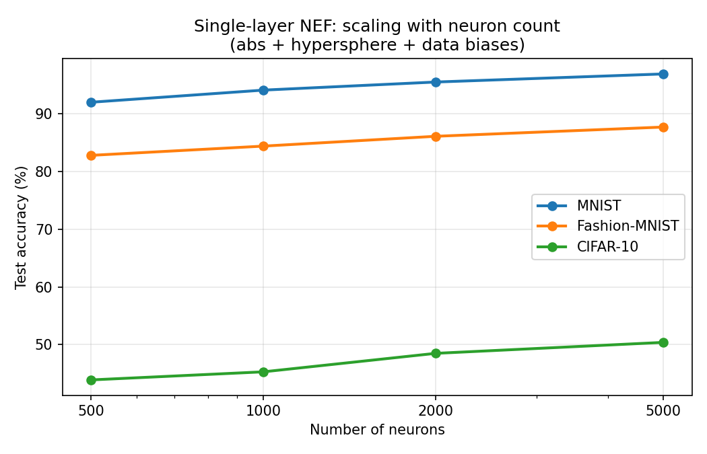
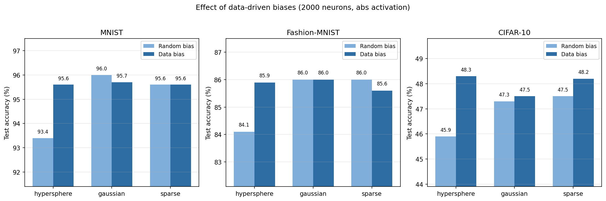
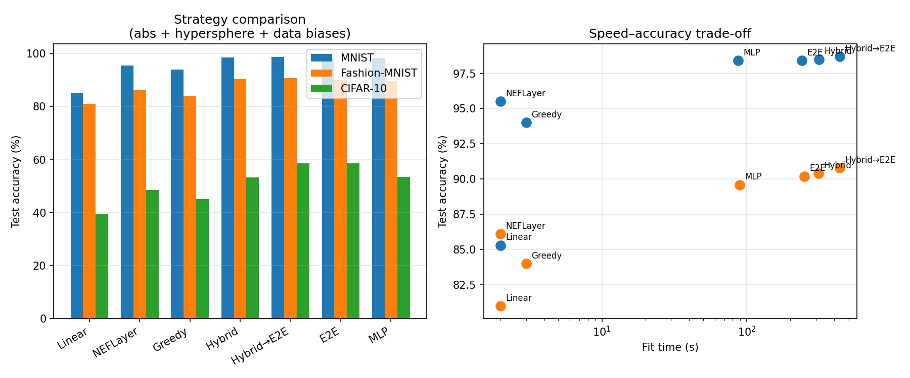
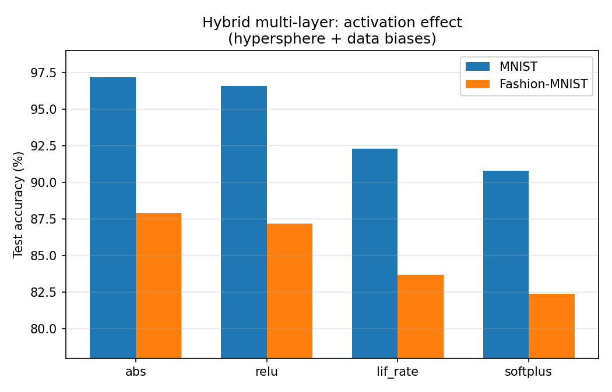

# leenef

Supervised learning with Eliasmith's Neural Engineering Framework (NEF),
using rate-based neurons on PyTorch.

## Overview

A standard neural network trains all weights with gradient descent.  NEF
takes a different approach: input weights (encoders) are random and fixed,
and output weights (decoders) are solved analytically via regularised
least-squares.  No gradient descent, no epochs, no learning rate — a single
layer trains in under 2 seconds.

Each neuron computes:

```
activity = |gain · ((x − d) · e)|
```

where **e** is a random unit vector (encoder direction), **d** is a
reference point sampled from training data (center), and **gain** is a
positive constant.  The neuron measures how the input deviates from a known
reference along a random direction — an unsigned distance, since the
absolute value responds to deviations in either direction.

Biases are derived from centers as `bias = −gain · (d · e)`, so there is no
separate bias distribution to tune.  Encoders are unit vectors on the
hypersphere; centers are sampled from training data.

The library provides `NEFLayer` for single-layer models and `NEFNetwork`
for multi-layer models, both plugging into standard PyTorch workflows:

```python
from leenef.layers import NEFLayer
from leenef.networks import NEFNetwork

# Single layer — analytic solve, no gradient descent
layer = NEFLayer(d_in=784, n_neurons=2000, d_out=10, centers=x_train)
layer.fit(x_train, y_train)
predictions = layer(x_test)

# Multi-layer — three training strategies
net = NEFNetwork(d_in=784, d_out=10, hidden_neurons=[1000],
                 output_neurons=2000, centers=x_train)
net.fit_greedy(x, targets)
net.fit_hybrid(x, targets)
net.fit_end_to_end(x, targets)
```

In a multi-layer `NEFNetwork`, hidden layers encode only (their neuron
activities become the next layer's input) and only the output layer decodes.
Three training strategies are available.  **Greedy** solves each layer
independently with random encoders and analytic decoders — no gradient
computation at all.  **Hybrid** alternates analytic decoder solves with
gradient updates to encoder weights, learning useful encoder orientations
without full backprop.  **End-to-end** runs standard SGD on all parameters,
initialised from a greedy NEF solve, using NEF as an initialisation
strategy rather than a training method.  **Hybrid→E2E** (`fit_hybrid_e2e`)
combines the two: hybrid first learns good encoder orientations, then E2E
refines all parameters including decoders — the best overall strategy.

## Setup

Requires Python 3.12+.

```bash
python3 -m venv venv
source venv/bin/activate
pip install -e '.[dev]'
```

## Tests

```bash
pytest                                     # full suite
pytest -k test_fit_identity -q             # single test
```

## Benchmarks

> All timings are from a CPU-only setup (AMD Ryzen 5 PRO 5650U, no GPU).

Default configuration: **abs** activation, **hypersphere** encoders,
**data-driven biases** (`centers=x_train`), Tikhonov solver (α = 0.01).

```bash
python benchmarks/run.py --datasets mnist fashion_mnist cifar10 \
       --neurons 500 1000 2000 5000 --regression
python benchmarks/run.py --datasets mnist fashion_mnist cifar10 \
       --neurons 2000 --multi --mlp
```

### Single-layer results

#### Scaling with neuron count

| Dataset       |  500   | 1000   | 2000   | 5000   |
|---------------|--------|--------|--------|--------|
| MNIST         | 92.0%  | 94.1%  | 95.5%  | 96.9%  |
| Fashion-MNIST | 82.8%  | 84.4%  | 86.1%  | 87.7%  |
| CIFAR-10      | 43.9%  | 45.3%  | 48.5%  | 50.4%  |

At 2000 neurons, MNIST reaches 95.5% in ~2 seconds — within 3% of a
fully-trained MLP that takes 40× longer.  Performance scales monotonically
with neuron count; fit time is under 12 seconds for 5000 neurons on 60k
samples (CPU).

#### Why data-driven biases matter (2000 neurons, abs activation)

|               | hyper  | + data | gauss  | + data | sparse | + data |
|---------------|--------|--------|--------|--------|--------|--------|
| MNIST         | 92.8%  |**95.5%**| 95.8% | 95.5%  | 95.8%  | 95.7%  |
| Fashion-MNIST | 83.8%  |**86.1%**| 86.1% | 86.1%  | 86.2%  | 86.2%  |
| CIFAR-10      | 45.2%  |**48.5%**| 47.4% | 48.5%  | 47.2%  | 48.7%  |

Without data-driven biases, hypersphere encoders lag Gaussian and sparse by
3–8%.  Data-driven biases **close the entire gap**.  The advantage of
Gaussian encoders was their varying norms creating an implicit distribution
of activation thresholds — data-driven biases make this explicit.  With
data biases, all encoder types converge to the same accuracy; the encoder
direction distribution no longer matters, only having enough random
directions does.

This is why the default uses hypersphere encoders (clean unit vectors,
principled random directions) plus data-driven biases (optimal threshold
placement) — rather than relying on Gaussian norms as an accidental proxy.

#### Activation comparison (2000 neurons, hypersphere, data biases)

| Activation | MNIST  | Fashion | CIFAR-10 |
|------------|--------|---------|----------|
| abs        |**95.5%**|**86.1%**|**48.5%**|
| relu       | 95.2%  | 85.8%   | 48.5%   |
| softplus   | 88.9%  | 81.7%   | 42.7%   |
| lif_rate   | 67.3%  | 76.5%   | 30.0%   |

Data-driven biases amplify the effect of activation choice.  With random
biases (not shown), all four activations cluster within ~1% of each other.
With data biases, neurons have more structured activation patterns with
sharper boundaries.  The abs and ReLU activations handle this well, but
softplus loses 7% on MNIST and lif_rate loses 28%.

The abs activation is a natural fit for the distance interpretation: each
neuron computes `|gain · ((x − d) · e)|`, responding to deviations in
either direction.  This doubles representational capacity compared to
ReLU, which discards one half of the encoding space.

#### Regression — California Housing (MSE, normalised targets)

| Neurons | Train MSE | Test MSE |
|---------|-----------|----------|
| 500     | 0.262     | 0.255    |
| 1000    | 0.248     | 0.243    |
| 2000    | 0.232     | 0.234    |
| 5000    | 0.210     | 0.223    |

More neurons improve accuracy with diminishing returns.  At 2000 neurons
the model generalises well, with test MSE within 1% of training MSE.

### Multi-layer results (hidden=[1000], output=2000)

| Model             | MNIST    | Fashion  | CIFAR-10 | Time (MNIST) |
|-------------------|----------|----------|----------|--------------|
| Linear baseline   | 85.3%    | 81.0%    | 39.6%    |     2s       |
| NEFLayer          | 95.5%    | 86.1%    | 48.5%    |     2s       |
| NEFNet-greedy     | 94.0%    | 84.0%    | 45.1%    |     3s       |
| NEFNet-hybrid     | 98.5%    | 90.4%    | 53.3%    |   314s       |
| NEFNet-hybrid→E2E |**98.7%** |**90.8%** |**58.5%** |   439s       |
| NEFNet-e2e        | 98.4%    | 90.2%    | 58.5%    |   239s       |
| MLP (2×1000)      | 98.4%    | 89.6%    | 53.4%    |    87s       |

The default hybrid configuration uses 50 iterations with α = 10⁻³ for the
decoder solver.  These were found via a systematic sweep over iterations
(10–100), solver regularisation (10⁻⁵–10⁻²), solver type (Tikhonov vs
Cholesky vs unregularised lstsq), hidden layer count, and neuron counts.

**Iterations dominate all other hyperparameters.** Going from 10 to 50
iterations lifts hybrid from 97.2% → 98.5% on MNIST, 87.9% → 90.4% on
Fashion, and 45.9% → 53.3% on CIFAR-10.  More layers, more neurons per
layer, and switching solvers each contribute less than 0.2%.  Returns
diminish past 50 iterations (75 and 100 barely improve).

**Lower decoder regularisation helps hybrid** but is dataset-dependent.
α = 10⁻³ is the sweet spot across all three datasets.  Going lower
(10⁻⁴) hurts Fashion and CIFAR-10 — the decoder overfits the current
encoder state, producing noisy gradients that destabilise encoder learning.
At α = 10⁻⁵ results collapse entirely (96.4% MNIST, 32.7% CIFAR-10).

**Hybrid→E2E is the best overall strategy.**  Running 50 hybrid iterations
then 20 E2E epochs (`fit_hybrid_e2e`) reaches 98.7% / 90.8% / 58.5% —
the highest accuracy on all three datasets.  The hybrid phase learns
good encoder orientations with analytic decoders; the E2E phase then
unlocks decoder learning to squeeze out the last gains.

Greedy multi-layer is *worse* than single-layer — stacking a random
nonlinear transform without learned features hurts rather than helps.

#### Hybrid improvement sweep

We also tested cross-entropy loss for encoder gradients, cosine LR
scheduling, incremental hidden-layer initialisation (warm-start from a
solved single-layer), and mini-batch gradient steps.  None improved on the
MSE full-batch baseline:

| Variant              | MNIST  | Fashion | CIFAR-10 |
|----------------------|--------|---------|----------|
| Baseline (MSE, flat) | 98.65% | 90.15%  | 52.67%   |
| CE loss              | 94.18% | 82.02%  | 37.23%   |
| Cosine schedule      | 98.34% | 89.98%  | 50.95%   |
| Incremental init     | 98.60% | 90.10%  | 52.86%   |
| Mini-batch (256, 3)  | 96.05% | 85.82%  | 38.71%   |

CE loss is catastrophic: the analytic decoder solve targets MSE (outputs
near 0/1 for one-hot targets), but cross-entropy interprets these as
logits, creating a destructive conflict.  Mini-batch hurts because
3 mini-batch steps provide far less gradient coverage than one full-batch
step.  Cosine annealing decays too aggressively — hybrid's decoder
re-solve already stabilises each iteration, making a flat LR optimal.
Incremental init is neutral: 50 iterations absorb the warm-start advantage.

#### Activation effect on multi-layer hybrid

| Activation | MNIST  | Fashion |
|------------|--------|---------|
| abs        |**97.2%**|**87.9%**|
| relu       | 96.6%  | 87.2%   |
| lif_rate   | 92.3%  | 83.7%   |
| softplus   | 90.8%  | 82.4%   |

> Measured with the old hybrid defaults (10 iterations, α = 10⁻²).

With data-driven biases, abs is the best activation for hybrid training.
This reverses an earlier finding where softplus was best with random
biases — the sharp distance structure created by data-driven biases
benefits from an activation that preserves it.

## Visualisations

Generate plots with `python benchmarks/plot.py` (requires matplotlib).






## Conclusions

1. **Data-driven biases are the key design choice.**  Rewriting the encoding
   as `|gain · ((x − d) · e)|` reveals each neuron measures unsigned
   deviation from a reference point *d* along direction *e*.  Sampling *d*
   from training data closes the entire 3–8% gap between encoder types and
   makes the encoder direction distribution irrelevant — only having enough
   random directions matters.

2. **Single-layer NEF is remarkably effective for its simplicity.**  With
   2000 neurons and a 2-second analytic solve, it reaches 95.5% on MNIST
   and 86.1% on Fashion-MNIST — within 3% of a fully-trained MLP that
   takes 40× longer.

3. **The abs activation is a natural fit.**  Computing an unsigned distance
   along the encoder direction doubles representational capacity by
   responding to deviations in either direction.  With data-driven biases,
   abs is the best activation for both single-layer and multi-layer models.

4. **Activation sensitivity is controlled by bias structure.**  With random
   biases, all activations perform within ~1%.  Data-driven biases create
   sharper activation patterns that reward sharp-threshold activations
   (abs, ReLU) and punish smooth ones (softplus −7%, lif_rate −28% on
   MNIST).

5. **Hybrid→E2E is the best overall strategy.**  Running hybrid then E2E
   reaches 98.7% / 90.8% / 58.5% — the highest accuracy on all three
   datasets.  The hybrid phase learns encoder orientations with analytic
   decoders; the E2E phase unlocks full gradient training to close the
   CIFAR-10 gap.

6. **Hybrid alone surpasses both E2E and MLP on easy datasets.**  With 50
   iterations and α = 10⁻³, pure hybrid reaches 98.5% MNIST / 90.4%
   Fashion while preserving analytic decoders.  Iterations dominate all
   other hyperparameters.

7. **Decoder regularisation is the second lever for hybrid.**  α = 10⁻³
   is optimal — lower values let decoders overfit the current encoder
   state, producing noisy gradients; higher values underfit.  At α = 10⁻⁵
   the training collapses entirely.

8. **CE loss is incompatible with hybrid's analytic decoders.**  Decoders
   solve for MSE-optimal outputs near 0/1; cross-entropy interprets these
   as logits, creating a destructive gradient conflict that drops CIFAR-10
   from 53% to 37%.  The loss used for encoder gradients must match the
   decoder objective.

9. **Greedy multi-layer hurts.**  An extra random nonlinear transform
   without learned features is worse than single-layer across all datasets.

## Related work

A single NEF layer — random input weights, nonlinear activation, analytic
output weights — is architecturally identical to an Extreme Learning Machine
(ELM; Huang et al., 2006).  Both are instances of the random features
framework (Rahimi & Recht, 2007), which shows that random projections
followed by a nonlinearity approximate kernel functions, with the number of
random features controlling approximation quality.  NEF arrives at the same
architecture from neuroscience principles: encoders model neuron preferred
directions, the activation models firing rates, and decoders recover the
represented signal.  The data-driven bias interpretation developed here —
each neuron measures deviation from a training sample — adds a connection
to radial basis function networks, where each basis function is centred on
a data point.

## Components

| Module | Purpose |
|--------|---------|
| `leenef/encoders.py` | Random encoder generation (hypersphere, Gaussian, sparse) |
| `leenef/activations.py` | Rate-based neuron models (ReLU, softplus, LIF rate, abs) |
| `leenef/solvers.py` | Decoder solvers (lstsq, Tikhonov, Cholesky) |
| `leenef/layers.py` | `NEFLayer(nn.Module)` — encode → activate → decode |
| `leenef/networks.py` | `NEFNetwork(nn.Module)` — multi-layer with greedy/hybrid/e2e |
| `benchmarks/run.py` | Benchmark harness with single-layer, multi-layer, and MLP baselines |
| `benchmarks/plot.py` | Visualisation script (generates `docs/*.png`) |

## References

- C. Eliasmith & C. H. Anderson, *Neural Engineering: Computation,
  Representation, and Dynamics in Neurobiological Systems*, MIT Press, 2003.
  [MIT Press](https://mitpress.mit.edu/9780262550604/)
- C. Eliasmith, "A unified approach to building and controlling spiking
  attractor networks", *Neural Computation* 17(6), 2005.
  [doi:10.1162/0899766053429390](https://doi.org/10.1162/0899766053429390)
- G.-B. Huang, Q.-Y. Zhu & C.-K. Siew, "Extreme learning machine: Theory
  and applications", *Neurocomputing* 70(1–3), 2006.
  [doi:10.1016/j.neucom.2005.12.126](https://doi.org/10.1016/j.neucom.2005.12.126)
  — the closely related random-feature approach from the ML side.
- A. Rahimi & B. Recht, "Random Features for Large-Scale Kernel Machines",
  *NeurIPS*, 2007.
  [paper](https://papers.nips.cc/paper/2007/hash/013a006f03dbc5392effeb8f18fda755-Abstract.html)

**Datasets:**
- [MNIST](http://yann.lecun.com/exdb/mnist/) — Y. LeCun et al., 1998.
- [Fashion-MNIST](https://github.com/zalandoresearch/fashion-mnist) — H. Xiao et al., 2017.
- [CIFAR-10](https://www.cs.toronto.edu/~kriz/cifar.html) — A. Krizhevsky, 2009.
- [California Housing](https://scikit-learn.org/stable/datasets/real_world.html#california-housing-dataset) — R. K. Pace & R. Barry, 1997 (via scikit-learn).
