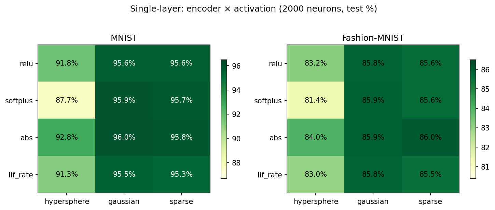

# leenef

Supervised learning experiments with Eliasmith's Neural Engineering Framework
(NEF), using rate-based neurons on PyTorch.

## Overview

Instead of training neural network weights with gradient descent, NEF
computes optimal output weights (decoders) analytically via regularised
least-squares.  Input weights (encoders) are random and fixed.  This is
equivalent to a random-feature model derived from neuroscience principles.

The library provides `NEFLayer` for single-layer models and `NEFNetwork`
for multi-layer models, both plugging into standard PyTorch workflows:

```python
from leenef.layers import NEFLayer
from leenef.networks import NEFNetwork

# Single layer — analytic solve, no epochs, no optimizer
layer = NEFLayer(d_in=784, n_neurons=2000, d_out=10)
layer.fit(x_train, y_train)
predictions = layer(x_test)

# Multi-layer — three training strategies
net = NEFNetwork(d_in=784, d_out=10, hidden_neurons=[1000], output_neurons=2000)
net.fit_greedy(x, targets)        # random hidden, analytic output
net.fit_hybrid(x, targets)        # analytic decoders + gradient encoders
net.fit_end_to_end(x, targets)    # full SGD with NEF initialisation
```

## Setup

Requires Python 3.12+.

```bash
python3 -m venv venv
source venv/bin/activate
pip install -e '.[dev]'
```

## Tests

```bash
pytest                                     # full suite
pytest -k test_fit_identity -q             # single test
```

## Benchmarks

Run the benchmark suite:

```bash
python benchmarks/run.py --datasets mnist fashion_mnist cifar10 \
       --neurons 500 1000 2000 5000 --regression
python benchmarks/run.py --datasets mnist fashion_mnist cifar10 \
       --neurons 2000 --multi --mlp --encoder gaussian
```

### Single-layer results (2000 neurons, Tikhonov solver, α = 0.01)

#### Scaling with neuron count (ReLU + hypersphere)

| Dataset        |  500   | 1000   | 2000   | 5000   |
|----------------|--------|--------|--------|--------|
| MNIST          | 88.4%  | 89.9%  | 92.1%  | 94.2%  |
| Fashion-MNIST  | 80.6%  | 82.0%  | 83.3%  | 84.5%  |
| CIFAR-10       | 40.8%  | 42.8%  | 44.8%  | 46.7%  |

#### Encoder × activation (2000 neurons, test accuracy)

|              | hypersphere | gaussian | sparse |
|--------------|-------------|----------|--------|
| **MNIST**    |             |          |        |
| relu         | 91.8%       | 95.6%    | 95.6%  |
| softplus     | 87.7%       | 95.9%    | 95.7%  |
| abs          | 92.8%       | **96.0%**| 95.8%  |
| lif_rate     | 91.3%       | 95.5%    | 95.3%  |
| **Fashion**  |             |          |        |
| relu         | 83.2%       | 85.8%    | 85.6%  |
| softplus     | 81.4%       | 85.9%    | 85.6%  |
| abs          | 84.0%       | 85.9%    | **86.0%**|
| lif_rate     | 83.0%       | 85.8%    | 85.5%  |

#### Regression — California Housing (MSE, normalised targets)

| Neurons | Train MSE | Test MSE |
|---------|-----------|----------|
| 500     | 0.270     | 0.287    |
| 1000    | 0.262     | 0.250    |
| 2000    | 0.246     | 0.240    |
| 5000    | 0.226     | 0.228    |

**Key findings:**
- Encoder distribution has far more impact than activation function.
  Gaussian and sparse encoders outperform hypersphere by 3–8%.
- `abs` (absolute value) is a surprisingly effective activation — it
  doubles representational capacity by responding to both sides of
  each neuron's preferred direction (96.0% MNIST, 86.0% Fashion).
- Performance scales monotonically with neuron count.
- CIFAR-10 is limited (~47%) by the single-layer architecture on 3072-d input.
- Fit time is under 12s for 5000 neurons on 60k samples (CPU).

### Multi-layer results (gaussian encoders, ReLU, hidden=[1000], output=2000)

| Model            | MNIST  | Fashion | CIFAR-10 | Time (MNIST) |
|------------------|--------|---------|----------|--------------|
| Linear baseline  |  85.4% |  80.6%  |  20.2%   |     1s       |
| NEFLayer         |  95.7% |  85.9%  |  46.6%   |     2s       |
| NEFNet-greedy    |  95.4% |  85.8%  |  46.1%   |     3s       |
| NEFNet-hybrid    |  96.0% |  86.0%  |  48.0%   |    64s       |
| NEFNet-e2e       |**98.0%**|**88.3%**|  43.7%   |   247s       |
| MLP (2×1000)     |**98.4%**|**89.6%**|**53.4%** |    87s       |

#### Activation effect on multi-layer (hybrid, gaussian encoders)

|              | MNIST  | Fashion |
|--------------|--------|---------|
| relu         | 96.0%  | 86.0%   |
| softplus     |**96.2%**|**86.5%**|
| abs          | 95.8%  | 86.2%   |
| lif_rate     | 93.6%  | 83.7%   |

**Key findings:**
- **End-to-end** with cross-entropy loss + cosine LR schedule reaches
  98.0% MNIST / 88.3% Fashion — nearly matching the MLP baseline.
  Overfits on CIFAR-10 (75% train, 44% test) — needs regularisation.
- **Hybrid** is the best pure-NEF strategy, gaining ~0.3–1.0% over
  single-layer by learning encoder orientations via gradient updates.
- **Greedy** multi-layer doesn't improve over single-layer — an extra
  random nonlinear transform doesn't add useful features.
- **Activation choice** matters more for multi-layer than single-layer:
  softplus is best for hybrid, while lif_rate falls behind (-2.3%
  on MNIST).  The smooth gradient of softplus likely helps the
  hybrid encoder updates.
- **Single-layer NEF** offers the best speed–accuracy trade-off:
  95.7% MNIST in 2s vs 98.4% MLP in 87s.

## Visualisations

Generate plots with `python benchmarks/plot.py` (requires matplotlib).





## Conclusions

1. **Single-layer NEF is remarkably effective for its simplicity.**
   With 2000 Gaussian-encoded neurons and an analytic solve taking ~2 seconds,
   it reaches 96% on MNIST and 86% on Fashion-MNIST — within 2–3% of a
   fully-trained MLP that takes 40× longer.

2. **Encoder distribution dominates activation choice** for single-layer
   models.  Switching from hypersphere to Gaussian encoders gains 3–8%,
   while the best vs worst activation differs by only ~1% (given a good
   encoder).  The non-monotonic `abs` activation slightly outperforms
   standard choices by responding to both sides of each neuron's
   preferred direction.

3. **The hybrid multi-layer strategy works**, but the gains are modest
   (~0.5%).  Alternating analytic decoder solves with gradient encoder
   updates lets the network learn useful encoder orientations without
   full backprop overhead.

4. **End-to-end SGD with NEF initialisation** closes most of the gap
   to a standard MLP (98.0% vs 98.4% on MNIST), confirming that NEF
   provides a strong weight initialisation.  However, it loses its speed
   advantage and overfits on harder datasets without additional
   regularisation.

5. **Activation choice matters more for multi-layer than single-layer.**
   Smooth activations (softplus) help gradient-based encoder updates;
   the biologically-inspired LIF rate curve hurts by ~2% due to its
   hard threshold creating gradient dead zones.

6. **CIFAR-10 exposes the limits** of a single random-feature layer on
   high-dimensional inputs (3072-d).  More neurons help, but the ceiling
   is ~47% without learned features or convolutional structure.

## Components

| Module | Purpose |
|--------|---------|
| `leenef/encoders.py` | Random encoder generation (hypersphere, Gaussian, sparse) |
| `leenef/activations.py` | Rate-based neuron models (ReLU, softplus, LIF rate, abs) |
| `leenef/solvers.py` | Decoder solvers (lstsq, Tikhonov, Cholesky) |
| `leenef/layers.py` | `NEFLayer(nn.Module)` — encode → activate → decode |
| `leenef/networks.py` | `NEFNetwork(nn.Module)` — multi-layer with greedy/hybrid/e2e |
| `benchmarks/run.py` | Benchmark harness with single-layer, multi-layer, and MLP baselines |
| `benchmarks/plot.py` | Visualisation script (generates `docs/*.png`) |
