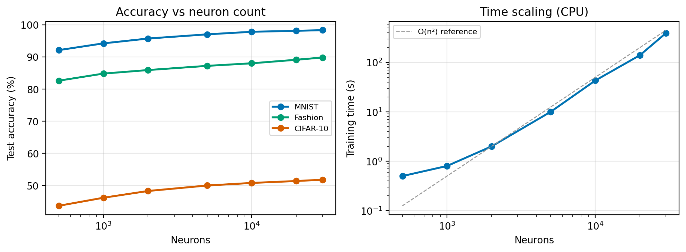
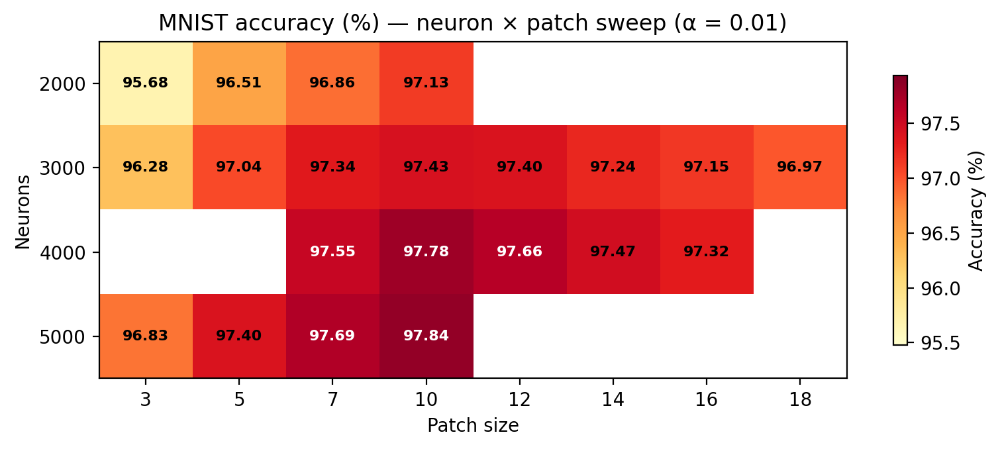
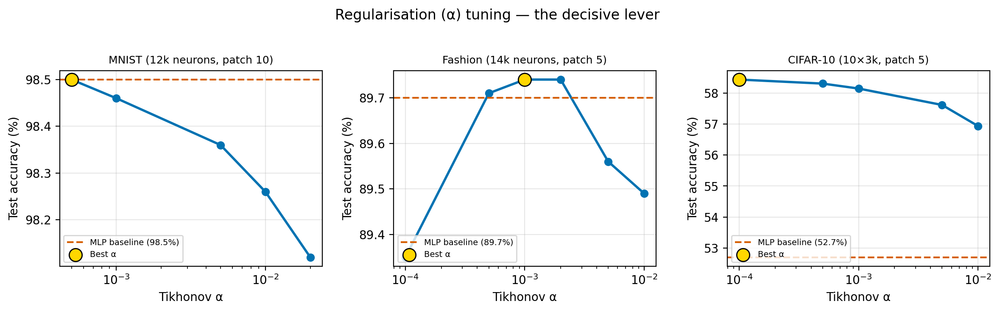
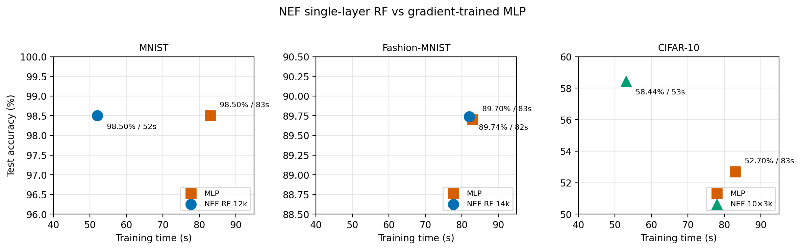
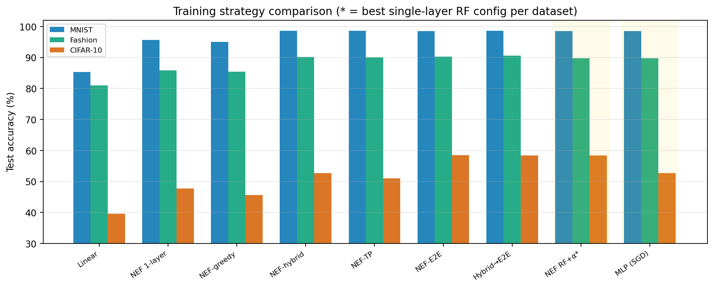
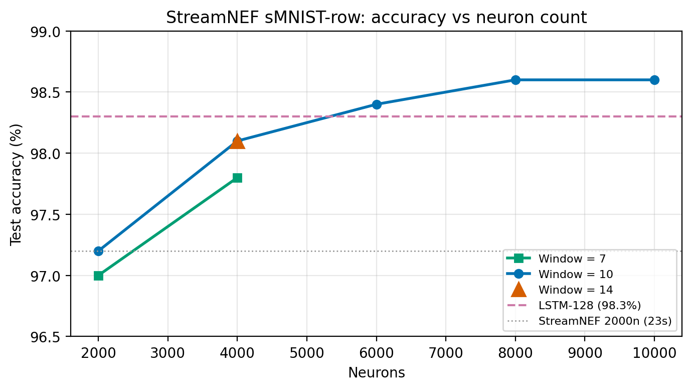
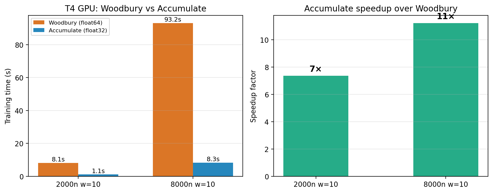

# Analytical Solvers Beat Gradient Descent: Supervised Learning via the Neural Engineering Framework

## Abstract

We present *leenef*, a PyTorch library that adapts the Neural Engineering
Framework (NEF) of Eliasmith and Anderson (2003) for supervised learning
using rate-based neurons.  A single NEF layer — fixed encoders, nonlinear
activation, analytically solved decoders — trains on MNIST in under two
seconds on a laptop CPU and reaches 95.5% accuracy.  This architecture is
structurally identical to an Extreme Learning Machine (ELM) and to random
kitchen sink features, but NEF's neuroscience-grounded formulation
motivates a distinctive design choice: *data-driven biases* derived from
training-sample centers.  We show that this single design choice closes
the entire 2–3% accuracy gap between encoder types (hypersphere, Gaussian,
sparse), making the encoder direction distribution irrelevant and reducing
hyperparameter sensitivity.  Because the two-second analytical solve
produces a strong base learner, we apply the ensemble playbook: training
10–20 independent models with different random seeds and combining
predictions via averaging.  Adding local receptive field encoders — where
each neuron sees a random image patch rather than the full input —
following McDonnell et al. (2015), provides a further accuracy boost.  We
report ensemble results on MNIST, Fashion-MNIST, and CIFAR-10.  A
systematic sweep over neuron counts, patch sizes, and regularization
strength reveals that properly configured single-layer RF models —
with dataset-tuned neuron counts, patch sizes, and Tikhonov α — match
a gradient-trained MLP on MNIST and Fashion-MNIST (98.5% and 89.7%,
both faster than MLP) and beat it on CIFAR-10 (58.4% vs 52.7%) — all
without gradient descent.
We further extend the framework to multi-layer networks with six training
strategies (greedy, hybrid, target propagation, end-to-end, hybrid→E2E,
and TP→E2E), recurrent temporal models, and
incremental/online learning via normal-equation accumulation.
For continuous learning, we introduce Woodbury rank-k updates that
maintain the system inverse incrementally in O(n²k) per batch instead of
O(n³) full re-solves.  Applied to temporal sequence classification, a
streaming delay-line reservoir classifier achieves 98.6% on sequential
MNIST on CPU — exceeding LSTM (98.5%) — entirely without gradient
descent, training in under four minutes on a laptop CPU or 8 seconds on
a GPU.  On harder temporal tasks where ordering is critical (Speech
Commands v2), mean pooling limits the approach to 76.3% vs LSTM's 90.3%.
Finally, we construct a fully gradient-free convolutional pipeline
(ConvNEF) that learns PCA-based convolutional filters from data patches,
applies multi-scale spatial pyramid pooling, and solves decoders
analytically.  A 10-member ConvNEF ensemble reaches 78.3% on
CIFAR-10 in 15 minutes on a T4 GPU — without any gradient computation,
backpropagation, or iterative optimization.


## 1. Introduction

The dominant paradigm in supervised learning trains all network weights via
gradient descent.  This is effective but computationally expensive: even a
small two-layer MLP on MNIST requires minutes of iterative optimization.
An alternative family of methods — dating back to random feature
approximations (Rahimi & Recht, 2007), extreme learning machines (Huang
et al., 2006), and the Neural Engineering Framework (Eliasmith & Anderson,
2003) — fixes the input-to-hidden weights and solves only the output
weights analytically.  Training reduces to a single regularized
least-squares solve, completing in seconds rather than minutes.

These methods share a common architecture but arrive at it from different
starting points.  ELMs treat random projections as a universal
approximation mechanism.  Random kitchen sinks view them as kernel
approximations.  NEF views them as population coding: each neuron has a
preferred direction (encoder), a tuning curve (activation function with
gain), and a decoding weight that recovers the represented quantity from
the population activity.  This neuroscience framing motivates several
design choices absent from the ELM and kernel literatures:

- **Data-driven biases** from training-sample centers, so each neuron's
  activation is centered around a known data point.
- **Per-neuron gain diversity**, following the NEF tradition of varied
  tuning curves within a population.
- **The absolute-value activation**, which gives each neuron a two-sided
  tuning curve responding to deviations in either direction from its center.
- **Data-adapted encoders** — in addition to random encoders (hypersphere,
  Gaussian, sparse), the library includes strategies that adapt encoder
  directions to training data: whitened encoders (PCA-subspace projection),
  class-contrast encoders (discriminative directions between classes), and
  local-PCA encoders (top eigenvector of each neuron's neighborhood).

The practical payoff of the two-second single-layer solve is not just
speed but *composability*.  A fast analytical solver is an ideal base
learner for ensembling (Breiman, 2001): train many independent models
with different random seeds and combine their predictions.  This is the
Random Forest playbook applied to random-feature networks.  When combined
with local receptive field encoders — where each neuron sees a random
local image patch (McDonnell et al., 2015) — the ensemble approach
produces competitive results without any gradient training.

The same analytical viewpoint extends beyond static images.  In temporal
classification, the streaming delay-line reservoir remains competitive
with LSTM baselines and, in some settings, surpasses them while training
substantially faster and without backpropagation through time.  This is
one of the report's strongest empirical results: the analytical NEF
approach is not just competitive on static classification, but also on
temporal sequence tasks that are usually treated as recurrent-model
territory.

This report makes the following contributions:

1. A clear exposition of the NEF-for-supervised-learning architecture,
   situating it within the broader context of ELMs, random features, and
   kernel methods.
2. An analysis of data-driven biases showing they close the accuracy gap
   between all encoder types and reduce the method to a single important
   hyperparameter (neuron count).
3. An ensemble module (`NEFEnsemble`) that leverages the fast analytical
   solve to train 10–20 diverse models in the time a single MLP would
   take.
4. Local receptive field encoders that inject spatial structure without
   gradient training.
5. Extensions to multi-layer networks (six training strategies, including
   two warm-started end-to-end variants and analytical target
   propagation), recurrent temporal models, incremental/online learning,
   and streaming temporal classification that exceeds LSTM on sMNIST-row
   on CPU and nearly matches it 2.7× faster on GPU — though mean pooling
   limits the approach on harder temporal tasks such as Speech Commands.
6. A fully gradient-free convolutional pipeline (ConvNEF) that learns
   PCA filters from data, extracts multi-scale features, and solves
   classification decoders analytically — reaching 78.3% on CIFAR-10.
7. Comprehensive benchmarks on MNIST, Fashion-MNIST, CIFAR-10, and
   California Housing, with timing on consumer hardware (CPU and GPU).


## 2. Background

This section provides the theoretical context needed to understand the
methods presented later.  We cover the Neural Engineering Framework, its
relationship to extreme learning machines and random feature methods,
ensemble methods, and local receptive field encoders.

### 2.1 The Neural Engineering Framework (NEF)

The NEF, introduced by Eliasmith and Anderson (2003), is a theoretical
framework for understanding how populations of neurons represent and
transform information.  It rests on three principles:

1. **Representation:** A quantity *x* is represented by the activities of a
   population of neurons.  Each neuron *i* has an encoder *eᵢ* (a preferred
   direction in the input space), a gain *αᵢ*, a bias *bᵢ*, and a
   nonlinear activation function *G*:

   ```
   aᵢ = G(αᵢ · eᵢ · x + bᵢ)
   ```

   The activity *aᵢ* is the neuron's firing rate, a scalar measuring how
   strongly the neuron responds to input *x*.

2. **Decoding:** The represented quantity can be recovered from the
   population activities by a linear decoder:

   ```
   x̂ = Σᵢ aᵢ · dᵢ = a · D
   ```

   where *D* is a matrix of decoding weights, found by minimizing the
   mean-squared error between decoded outputs and the true values over a
   set of representative inputs.  This yields a regularized least-squares
   problem:

   ```
   D = argmin_D ||A · D − Y||² + λ||D||²
   ```

   where *A* is the matrix of activities (samples × neurons), *Y* is the
   target matrix, and *λ* is a regularization parameter.

3. **Transformation:** To compute a function *f(x)* rather than
   representing *x* itself, one simply changes the decoding targets from
   *x* to *f(x)*.  The same population of neurons can simultaneously
   represent *x* and compute arbitrary functions of it, with different
   decoders for each.

The key architectural insight is that encoders are fixed (either
biologically determined or randomly sampled) and decoders are *solved
analytically*.  This avoids iterative weight updates entirely for a single
population.

In the original NEF formulation, the bias *bᵢ* is typically determined by
a gain-intercept pair that shapes the neuron's tuning curve.  Our
adaptation replaces this with *data-driven biases* (Section 3.2), where
the bias is derived from a training-sample center.

### 2.2 Extreme Learning Machines (ELM)

The Extreme Learning Machine (Huang et al., 2006) is a single-hidden-layer
feedforward network where input weights and biases are randomly assigned
and never updated.  Only the output weights are trained, via a
least-squares solve:

```
H = g(X · W + b)       (hidden layer activation)
β = H† · Y             (output weights via pseudoinverse)
```

where *g* is a nonlinear activation, *W* and *b* are random, and *H†* is
the Moore-Penrose pseudoinverse of the hidden-layer activation matrix.

Huang et al. proved that a single-hidden-layer ELM with *N* hidden neurons
and any continuous activation function is a universal approximator: as *N*
grows, the network can approximate any continuous function on a compact
set.  The practical implication is that ELMs trade architectural efficiency
(more neurons needed than a trained network) for training speed (one matrix
solve vs. many gradient steps).

**Relationship to NEF:**  A single NEF layer with random encoders and an
analytical decoder solve is architecturally identical to an ELM.  The
difference is interpretive: NEF's encoders represent preferred directions,
its gain controls tuning-curve width, and its biases locate each neuron's
sensitive region in input space.  These interpretations motivate design
choices (data-driven biases, abs activation, per-neuron gain diversity)
that improve accuracy beyond a vanilla ELM.

### 2.3 Random Features and Kernel Approximation

Rahimi and Recht (2007) showed that random projections followed by a
nonlinearity approximate kernel functions.  Specifically, if *ω* is drawn
from a distribution *p(ω)* related to the kernel's Fourier transform, then:

```
k(x, y) ≈ (1/D) Σⱼ z_ωⱼ(x) · z_ωⱼ(y)
```

where *z_ωⱼ(x) = exp(i ωⱼ · x)* are random Fourier features.  In
practice, the exponential is often replaced by other nonlinearities
(ReLU, cosine, etc.) that approximate different kernels.

This framework — known as "random kitchen sinks" — provides a theoretical
justification for why random-weight networks work: they are performing
kernel regression in an approximate feature space.  The number of random
features controls approximation quality, just as the number of neurons
controls representational capacity in NEF and ELMs.

Random kitchen sinks on MNIST with 2000 features typically achieve 94–96%
accuracy (Rahimi & Recht, 2007; various reproductions), comparable to our
NEF single-layer result (95.5%).

### 2.4 Data-Driven Biases and Radial Basis Functions

Our implementation adds a *center* parameter to each neuron.  Given a
center *dᵢ* (sampled from training data) and an encoder *eᵢ*, the
neuron's response becomes:

```
aᵢ = |αᵢ · ((x − dᵢ) · eᵢ)|
```

which can be rewritten as:

```
aᵢ = |αᵢ · (x · eᵢ − dᵢ · eᵢ)|
     = |αᵢ · (x · eᵢ + bᵢ)|
```

where `bᵢ = −αᵢ · (dᵢ · eᵢ)`.  The neuron measures the *unsigned
deviation* of the input from its center along its encoder direction.

This connects to radial basis function (RBF) networks (Broomhead & Lowe,
1988), where each basis function is centered on a data point.  The
difference is that RBF neurons measure distance in *all* directions
(isotropic Gaussian kernels), while NEF neurons measure distance along a
*single random direction*.  Having many neurons with different random
directions recovers approximate omnidirectional sensitivity — a
Johnson-Lindenstrauss-style argument ensures that enough random projections
preserve distance relationships.

The practical effect is dramatic (Section 5.2): without data-driven biases,
hypersphere encoders lag Gaussian encoders by 2–3% because Gaussian
encoder norms create an implicit distribution of activation thresholds.
Data-driven biases make this explicit and optimal, closing the entire gap.
Section 3.2 returns to the same idea from the implementation perspective,
and Section 5.2 quantifies the resulting accuracy gain.

### 2.5 Ensemble Methods

Ensemble methods combine multiple models to improve prediction accuracy and
robustness.  The theoretical foundation rests on the bias-variance
decomposition: if individual models have uncorrelated errors, averaging
their predictions reduces variance without increasing bias (Breiman, 2001).

**Bagging** (Bootstrap Aggregating; Breiman, 1996) trains each model on a
random bootstrap sample of the training data.  **Random Forests** (Breiman,
2001) combine bagging with random feature subsets at each split, increasing
diversity among trees.  The key insight is that *randomness in model
construction* — not just data sampling — improves ensemble diversity and
thus accuracy.

For random-feature networks like ELMs and NEF layers, each model already
uses different random encoders (analogous to different random feature
subsets in Random Forests).  Training multiple NEF layers with different
random seeds creates natural diversity without bootstrap sampling, though
the two can be combined.

The ensemble improvement depends on the *correlation* between member
predictions.  If members produce identical predictions (correlation = 1),
ensembling provides no benefit.  If predictions are uncorrelated,
averaging *K* members reduces variance by a factor of *K*.  Random-feature
networks are well-suited because each member's errors are substantially
driven by the particular random projection, making errors relatively
uncorrelated across members with different seeds.

### 2.6 Local Receptive Field Encoders

McDonnell et al. (2015) demonstrated that combining ELMs with local
receptive fields dramatically improves image classification.  Instead of
each hidden neuron receiving a random projection of the *entire* input
image, each neuron sees only a small random *patch*.  This injects
spatial locality — similar to the convolution operation in CNNs — without
any learned filters.

Their results on MNIST were striking:
- Single ELM (global random weights, 10000 neurons): ~96%
- Single ELM + local receptive fields (10000 neurons): ~98.8%
- Ensemble of 10 ELMs + local receptive fields: **99.17%**

The receptive field approach works because natural images have strong
local structure: neighboring pixels are highly correlated and local
patterns (edges, corners, textures) are more informative than global
projections.  A random projection of the full 784-dimensional MNIST image
dilutes local structure across all dimensions.  A random projection of a
5×5 patch (25 dimensions) concentrates the neuron's sensitivity on a
local feature.

### 2.7 Incremental Learning via Normal Equations

The standard decoder solve requires computing `D = (AᵀA + λI)⁻¹ AᵀY` on
the full dataset.  The key observation is that the sufficient statistics
`AᵀA` and `AᵀY` are *additive*: they can be accumulated across data
batches and the solve performed once at the end.

Given batches *A₁, Y₁*, *A₂, Y₂*, ..., *Aₖ, Yₖ*:

```
AᵀA = Σⱼ Aⱼᵀ Aⱼ
AᵀY = Σⱼ Aⱼᵀ Yⱼ
D = (AᵀA + λI)⁻¹ AᵀY
```

This enables streaming/online learning: data can arrive in chunks, each
contributing to the running totals, with the solve deferred until all data
has been seen.  It also enables updating an existing model with new data
without reprocessing old data, provided the old sufficient statistics are
retained.

This decomposition is well-known in recursive least-squares and online
learning (see, e.g., Haykin, 2002), and is particularly natural for NEF
and ELM architectures where the sufficient statistics are the only
information needed from the training data.

### 2.8 Continuous Learning via the Woodbury Identity

Accumulating `AᵀA` and `AᵀY` (Section 2.7) supports deferred-batch
solving: decoders are updated only when a full re-solve is triggered.
For *continuous* learning — where decoders must be current after every
incoming batch — we need to update the system inverse incrementally.

The Sherman-Morrison-Woodbury identity (Woodbury, 1950; Hager, 1989)
provides the tool.  Let M = AᵀA + αI be the current system matrix with
cached inverse M⁻¹.  When a new batch B (k × n) arrives, the system
matrix becomes M_new = M + BᵀB, and the updated inverse is:

```
M_new⁻¹ = M⁻¹ − M⁻¹ Bᵀ (Iₖ + B M⁻¹ Bᵀ)⁻¹ B M⁻¹
```

This *rank-k update* costs O(n²k + k³) — far cheaper than the O(n³) full
re-solve when k ≪ n (i.e. the batch size is much smaller than the neuron
count).  The decoders are then D = M_new⁻¹ · (AᵀY), where AᵀY
accumulates as before.

**Initialization.**  Rather than computing M⁻¹ from the first batch
(which may be ill-conditioned when k < n), we initialize M⁻¹ = (1/α)I
— the inverse of the pure regularizer.  All batches then enter through
the Woodbury path, ensuring consistent conditioning.

**Numerical precision.**  Repeated rank-k updates in `float32` accumulate
rounding errors that compound across many updates.  For large n
(thousands of neurons) and many batches, this drift can be catastrophic.
Two mitigations are used:

1. **`float64` inverse.**  The cached M⁻¹ and all Woodbury arithmetic are
   performed in `float64`.  The final decoder computation casts back to the
   model's working dtype.

2. **Periodic refresh.**  Since the sufficient statistics AᵀA and AᵀY are
   accumulated alongside the Woodbury updates, a full re-solve
   `M⁻¹ = inv(AᵀA + αI)` can be triggered periodically to reset any
   accumulated drift.

**Adaptive fallback.**  When a batch has k ≥ n (more samples than
neurons), the direct re-solve from accumulated statistics is both cheaper
and more numerically stable, so the Woodbury path is bypassed.


## 3. Method

### 3.1 NEF Layer Architecture

A `NEFLayer` implements the three-stage NEF pipeline:

1. **Encode:** Project input *x* into neuron space:
   ```
   z = gain · (x · Eᵀ) + bias
   ```
   where *E* ∈ ℝⁿˣᵈ is the encoder matrix (rows are unit vectors), *gain*
   is a per-neuron scalar, and *bias* is derived from centers.

2. **Activate:** Apply a nonlinear activation:
   ```
   a = σ(z)
   ```
   Default: `σ = abs` (Section 3.3).

3. **Decode:** Map activities to the output:
   ```
   ŷ = a · D
   ```
   where *D* ∈ ℝⁿˣᵒ is the decoder matrix, solved via regularized
   least-squares.

**Encoder strategies.**  The library provides seven encoder strategies,
selected by string name from a registry:

| Strategy          | Description |
|-------------------|-------------|
| `hypersphere`     | Uniform random unit vectors on the unit hypersphere (default) |
| `gaussian`        | i.i.d. Gaussian entries (varying norms) |
| `sparse`          | Sparse random projections (~1/3 non-zero entries) |
| `receptive_field` | Sparse local-patch encoders for images (Section 3.5) |
| `whitened`        | PCA-subspace projection adapting to data covariance |
| `class_contrast`  | Discriminative directions from each class toward nearest other class |
| `local_pca`       | Top eigenvector of each neuron's local neighborhood |

The first four strategies produce purely random encoders.  The last three
adapt encoder directions to the training data, providing richer
representations at the cost of a data-dependent initialization step.
All strategies except `receptive_field` produce dense vectors.  The
`receptive_field` strategy produces vectors that are zero everywhere
except at a random local image patch.

**Decoder solvers.**  Three solvers are available:

| Solver      | Description |
|-------------|-------------|
| `tikhonov`  | `(AᵀA + αI)⁻¹ AᵀY` via `torch.linalg.solve` (LU-based, default) |
| `cholesky`  | Same system solved via Cholesky factorisation (`torch.linalg.cholesky` + `cholesky_solve`) |
| `lstsq`     | `torch.linalg.lstsq` (unregularized or implicitly regularized) |

The default solver is Tikhonov with α = 0.01.

### 3.2 Data-Driven Biases

Section 2.4 gave the conceptual interpretation of centered NEF neurons as
directional, RBF-like features.  Here we spell out the concrete bias
construction used in the library.

Given a set of training samples *X*, each neuron *i* is assigned a center
*dᵢ* sampled uniformly from *X*.  The bias is then:

```
bᵢ = −gain_i · (dᵢ · eᵢ)
```

This ensures that `aᵢ = σ(gain_i · ((x − dᵢ) · eᵢ))`, so the neuron's
zero-crossing is at the projection of its center onto its encoder
direction.  With the abs activation, the neuron responds symmetrically to
deviations in either direction from this zero-crossing.

Without data-driven biases, the library falls back to i.i.d. Gaussian
biases, which do not account for the data distribution.  Section 5.2 shows
that this concrete construction closes a 2–3% accuracy gap in practice.

### 3.3 Activation Functions

Four activation functions are provided:

| Name       | Definition | Properties |
|------------|------------|------------|
| `abs`      | \|z\|      | Two-sided response; gradient ±1 everywhere; default for feedforward |
| `relu`     | max(0, z)  | One-sided; sparse gradients; default for recurrent |
| `softplus` | log(1 + eᶻ) | Smooth approximation to ReLU |
| `lif_rate` | 1/(1 − e⁻ᶻ) for z > 0 | Leaky integrate-and-fire rate model |

The **abs activation** is a natural fit for the NEF distance
interpretation: `|gain · ((x − d) · e)|` responds to deviations in
*either* direction along the encoder, effectively doubling representational
capacity compared to ReLU.  With data-driven biases, abs consistently
outperforms other activations for single-layer classification (Section 5.3).

For **recurrent models**, abs has gradient ±1 everywhere (no sparsity),
causing gradient explosion through backpropagation through time (BPTT).
ReLU's zero gradient on negative inputs provides the damping needed for
stable recurrent gradient flow.

### 3.4 Per-Neuron Gain

In canonical NEF, each neuron has its own gain sampled from a
distribution, creating diverse tuning curves.  Our default samples gain
from U(0.5, 2.0), meaning neurons vary in sensitivity: low-gain neurons
have wide, gentle tuning curves while high-gain neurons have narrow,
sharp responses.  This diversity enriches the population representation
without additional parameters.

### 3.5 Local Receptive Field Encoders

The `receptive_field` encoder strategy creates sparse encoders where each
neuron sees a random local image patch:

1. Sample a random patch position *(r, c)* uniformly over valid positions
   (ensuring the patch fits within the image).
2. Generate random weights *w* ∈ ℝᵖ² (or ℝᵖ²ᶜ for *C*-channel images)
   and normalize to unit norm.
3. Construct the full encoder vector by placing *w* at the appropriate
   pixel indices and zeros elsewhere.

This creates *N* × *D*-dimensional encoder vectors (same shape as other
strategies) but with only *patch_size²* non-zero entries per neuron.  The
unit-norm convention is maintained within the patch, consistent with the
hypersphere strategy.

For multi-channel images (e.g., CIFAR-10 with 3 color channels), the
patch covers all channels at each spatial position, giving
*patch_size² × C* non-zero entries per encoder.

### 3.6 NEF Ensemble

`NEFEnsemble` trains *K* independent `NEFLayer` models, each with a
different random seed (and thus different random encoders, centers, and
gains).  Predictions are combined by one of two methods:

- **Mean** (default): Average the output vectors across members.  For
  classification with one-hot targets, this averages the predicted class
  probabilities.
- **Vote**: Each member's argmax prediction is a vote; the class with the
  most votes wins.

The ensemble exploits the fact that different random projections produce
different error patterns.  When errors are uncorrelated across members,
averaging reduces the effective error rate.

### 3.7 Incremental / Online Learning

`NEFLayer` supports incremental learning via three methods:

- `partial_fit(x, targets)` — encodes the batch, computes `AᵀA` and
  `AᵀY`, and adds them to running totals stored as registered buffers.
- `solve_accumulated(alpha)` — solves decoders from the accumulated
  sufficient statistics.
- `reset_accumulators()` — clears the running totals.

This produces the same result as `fit()` on the full dataset (up to
floating-point accumulation order) but supports streaming data, memory
constraints, and model updates with new data.

#### 3.7.1 Continuous Fit with Woodbury Updates

For applications that require up-to-date decoders after every batch — not
just after a deferred final solve — `NEFLayer` provides:

- `continuous_fit(x, targets, alpha)` — encodes the batch, accumulates
  `AᵀA` / `AᵀY`, and applies a rank-k Woodbury update (Section 2.8) to
  the cached system inverse.  Decoders are recomputed immediately.
- `continuous_fit_encoded(activities, targets, alpha)` — the same, but
  accepts pre-computed activity matrices.  Used by downstream modules
  (e.g. `StreamingNEFClassifier`) that pool or transform activities before
  the decoder solve.
- `refresh_inverse(alpha)` — recomputes M⁻¹ exactly from the accumulated
  AᵀA to correct any Woodbury drift.
- `reset_continuous()` — clears the inverse cache and accumulators.

The Woodbury inverse is stored in `float64` regardless of the model's
working dtype.  This prevents the catastrophic drift observed with `float32`
when many rank-k updates accumulate on large inverse matrices (thousands
of neurons × hundreds of batches).  The final decoder product casts back
to the model dtype.

#### 3.7.2 Accumulate + Solve (GPU-Friendly Path)

The Woodbury path's `float64` requirement is a significant bottleneck on
consumer GPUs.  The Tesla T4, for example, delivers only 1/32 of its
`float32` throughput in `float64`.  For workloads where online decoder updates
are not required — i.e. the model only needs to be accurate *after* seeing
all data — the library provides a lighter alternative:

- `accumulate(x, targets)` — encodes the batch and computes AᵀA/AᵀY
  entirely in `float32`, then promotes the n×n and n×d_out results to
  `float64` for accumulation.  No inverse is maintained; cost is O(n²k)
  `float32` matmul per batch plus an O(n²) dtype cast.
- `solve(alpha)` — performs a single regularized solve from the
  accumulated statistics in `float64`, then casts decoders back to
  `float32`.
  Cost is O(n³), once.

The key advantage over Woodbury is that **all O(n²k) matmuls are
`float32`**: Woodbury performs O(n²k) `float64` work per batch to update
the inverse, while accumulate does O(n²k) `float32` work per batch (fast
GPU tensor cores) and only uses `float64` for the O(n²) accumulator
additions and the single final solve.  A single batch's outer product
has sufficient precision in `float32`; the running sum across batches is
where `float64` matters.

Both paths share the same AᵀA/AᵀY accumulators, so they can be mixed:
use `accumulate()` for the main data pass, then switch to `continuous_fit()`
for subsequent online updates if needed.

### 3.8 Multi-Layer Networks

`NEFNetwork` stacks multiple `NEFLayer` modules.  Hidden layers
encode only: their neuron activities (not decoded outputs) become the
next layer's input.  Only the output layer decodes.

Six training strategies are available:

1. **Greedy** (`fit_greedy`): Random hidden encoders, analytical output
   decoders.  No gradients.  Fastest but limited.
2. **Hybrid** (`fit_hybrid`): Alternates analytical decoder solves with
   gradient updates to encoder weights.  The decoder re-solve at each
   iteration stabilises training and allows a constant learning rate.
3. **Target propagation** (`fit_target_prop`): Replaces backpropagation
   with layer-local targets via NEF representational decoders (analytical
   inverse models) and difference target propagation (Lee et al., 2015).
   Single-layer gradients only.  Described in detail below.
4. **End-to-end** (`fit_end_to_end`): Standard SGD on all parameters,
   initialized from a greedy NEF solve.
5. **Hybrid→E2E** (`fit_hybrid_e2e`): Hybrid warm start followed by E2E
   fine-tuning.
6. **TP→E2E** (`fit_target_prop_e2e`): Target propagation warm start
   followed by E2E fine-tuning.

#### 3.8.1 Analytical Target Propagation (NEF-TP)

Standard target propagation (Lee et al., 2015) replaces backpropagation
with layer-local targets.  Each layer receives a target — what its
activities *should* have been to reduce the loss — and updates its weights
to match that target using only a local gradient.  Targets propagate
backward through learned "inverse models" rather than gradients.

**Difference target propagation (DTP)** adds a correction term to prevent
error accumulation across layers:

```
target_l = a_l + g_{l+1}(target_{l+1}) − g_{l+1}(a_{l+1})
```

When `target_{l+1} = a_{l+1}` (no change needed), the target for layer
*l* is exactly its current activities.

The key insight for NEF-TP is that **NEF representational decoders are
the inverse models that target propagation needs**.  In Eliasmith's NEF,
every neural population has a representational decoder that recovers the
encoded quantity from activities:

```
x̂ = a · D_repr    where D_repr = argmin_D ‖A · D − X‖²
```

This is solved analytically — no gradient training needed for the inverse
model.

**Training loop** for a network with L hidden layers and one output layer:

```
for each iteration:
    # Forward pass
    a[0] = x
    for l = 1 to L:
        a[l] = activate(gain_l · (a[l−1] · E_l^T) + b_l)
    a[L+1] = activate(gain_out · (a[L] · E_out^T) + b_out)

    # Solve decoders (all analytical, no gradients)
    D_out     = solve(a[L+1], targets)           # task decoder
    D_repr[l] = solve(a[l], a[l−1])  for l = 1…L+1  # representational decoders

    # Compute targets backward (no backprop)
    target[L+1] = a[L+1] − η · (a[L+1] · D_out − targets) · D_out^T
    for l = L down to 1:
        target[l] = a[l] + (target[l+1] − a[l+1]) · D_repr[l+1]  # DTP

    # Local encoder updates (parallelizable across layers)
    for l = 1 to L+1:
        loss_l = ‖encode_l(a[l−1]) − target[l]‖²
        update E_l, b_l with ∇loss_l
```

All decoder solves are analytical.  Encoder updates use only single-layer
gradients — no gradient flows between layers, and layer updates can in
principle run in parallel.

The step size η controls how aggressively the output target departs from
current activities.  Too large pushes targets outside the feasible
activity space; too small provides no learning signal.  Defaults: η=0.03
for plain TP, η=0.01 for TP→E2E warm starts.

**Comparison with hybrid training:**

| Property              | Hybrid               | NEF-TP                |
|-----------------------|----------------------|-----------------------|
| Gradient scope        | Full backprop        | Single layer          |
| Decoder solves / iter | 1 (output only)      | L+1 (all layers)     |
| Encoder gradient cost | O(L × forward)       | O(1 × forward) each  |
| Parallelizable        | No (chain rule)      | Yes (layer-independent) |
| Memory                | Full computation graph | Per-layer only        |
| Biological plausibility | Low                | Higher (local rules)  |

TP solves more decoders per iteration (cheap with our analytical solvers)
but saves on gradient computation.  For deep networks, TP should be faster
per iteration; whether it converges in fewer or more iterations is
task-dependent.

**Activation considerations for TP.**  The abs activation is many-to-one
(`abs(z) = abs(−z)`), so two inputs differing only in sign along an
encoder direction produce identical activities and the representational
decoder cannot distinguish them.  With enough random encoder directions
and data-driven biases, this is unlikely to matter (Johnson-Lindenstrauss
argument), and in practice abs gives the representational decoder richer
(always-nonzero) activities to work with.  ReLU's zero-gradient region
makes the decoder's job harder (zero activities carry no information), but
non-zero activities are fully informative.

### 3.9 Recurrent Models

`RecurrentNEFLayer` extends the feedforward pipeline with the canonical
NEF decode-then-re-encode feedback loop.  At each timestep *t*:

```
x_aug = concat(u[t], s[t−1])                  # input + previous state
a[t]  = σ(gain · (x_aug · Eᵀ) + bias)         # encode + activate
s[t]  = a[t] · D_state                        # state decoder (feedback)
y     = a[T] · D_out                          # output decoder (final step)
```

The **state decoder** extracts a low-dimensional state summary that feeds
back through the encoders.  The **output decoder** produces the task
prediction at the final timestep.  Training strategies parallel the
feedforward case: greedy, hybrid, target propagation through time (TPTT),
end-to-end BPTT, and warm-started combinations.

### 3.10 Streaming Temporal Classifier

`StreamingNEFClassifier` combines the delay-line reservoir idea from
computational neuroscience with the continuous Woodbury updates of
Section 3.7.1 to classify variable-length temporal sequences without
gradient descent.

**Architecture.**  Given an input sequence x ∈ ℝ^(T × d):

```
x_seq   (N, T, d)
   │
   ▼  delay-line: concatenate K consecutive timesteps
(N, T, K·d)
   │
   ▼  random NEF encoding per timestep
activities  (N, T, n_neurons)
   │
   ▼  mean pooling over time
pooled  (N, n_neurons)
   │
   ▼  linear decoder
output  (N, d_out)
```

The delay-line with window size K gives each neuron access to a short
temporal context of K consecutive timesteps.  The beginning is zero-padded
so that each timestep has a full K-length window.  Mean pooling collapses
the temporal dimension into a fixed-size representation regardless of
sequence length.

**Training.**  Three modes:

1. **Batch fit** — computes the full pooled activity matrix and solves
   decoders via standard Tikhonov (Section 3.1).
2. **Continuous fit** — processes sequences in chunks via Woodbury updates
   (Section 2.8), maintaining up-to-date decoders after each chunk.
3. **Accumulate + solve** — processes sequences in chunks, accumulating
   AᵀA/AᵀY in `float32`, then solves once at the end (Section 3.7.2).
   Mathematically equivalent to batch fit but memory-efficient and
   GPU-friendly (no `float64` required).

The continuous mode enables genuine streaming: sequences arrive
incrementally and the model is usable at any point.  A final
`refresh_inverse()` call corrects any accumulated numerical drift.
The accumulate mode is preferred on consumer GPUs where `float64`
throughput is limited.

**Chunked encoding.**  To limit peak memory, `encode_sequence` processes
samples in chunks when the total token count (N × T) exceeds a threshold.
This is critical for large models — e.g. 60000 sequences × 28 timesteps
× 4000 neurons would require 26.8 GB without chunking.


### 3.11 Gradient-Free Convolutional Pipeline (ConvNEF)

The preceding sections demonstrate that single-layer NEF models with
random or local receptive field encoders plateau at ~58% on CIFAR-10 —
competitive with gradient-trained MLPs but far below convolutional
architectures.  Natural images have spatial structure that random
global projections cannot exploit.  To close this gap without
introducing gradient descent, we construct a fully gradient-free
convolutional feature extraction pipeline that feeds into the standard
NEF analytical decoder.

**Architecture overview.**  The pipeline has two stages:

1. **Convolutional feature extraction** — one or more `ConvNEFStage`
   modules extract local features from image patches, apply fixed
   (non-learned) convolutional filters, a nonlinear activation, and
   spatial pooling.
2. **Analytical classification** — a `NEFLayer` maps the extracted
   features to class labels via the standard analytic Tikhonov solve.

The entire pipeline — filter learning, feature extraction, and
classification — uses no gradient computation whatsoever.

#### 3.11.1 ConvNEFStage: Data-Driven Filter Learning

Each `ConvNEFStage` extracts patches of size p × p (or p_h × p_w for
rectangular patches) from the input images, learns a set of F filters
from the data, and applies them as fixed `conv2d` weights.

**Filter learning.**  Patches are sampled from training images and the
top F principal components are computed via PCA.  These eigenvectors
become the convolutional filters — they capture the dominant local
structure of the dataset without any gradient optimization.  The filters
are stored as frozen buffers (not `nn.Parameter`) and never updated.

**Forward pass.**  Given an input image batch:

```
x           (N, C, H, W)
   │
   ▼  conv2d with PCA filters, stride 1, same padding
features    (N, F, H, W)
   │
   ▼  abs activation
activities  (N, F, H, W)
   │
   ▼  average pooling (kernel_size, stride)
output      (N, F, H', W')
```

The abs activation — consistent with the NEF single-layer choice — is
used because PCA filters have no preferred sign: a positive or negative
projection onto an eigenvector is equally informative.

**Optional preprocessing.**  Stages support several preprocessing
options that are applied before filter learning and/or at inference:

- **Feature standardization** (`standardize=True`) — zero-mean,
  unit-variance normalization of the flattened feature vector after
  pooling.  This is the single largest accuracy lever in our experiments
  (Section 5.11).
- **Global contrast normalization** (`gcn=True`) — per-image
  mean-subtraction and L2-normalization, applied before convolution.
- **Local contrast normalization** (`lcn_kernel`) — subtractive and
  divisive normalization in a local spatial window, applied before
  convolution.
- **Patch normalization** (`patch_normalize=True`) — center each
  extracted patch to zero mean before PCA, removing the DC component.

#### 3.11.2 Multi-Scale Parallel Stages

A single patch size captures features at only one spatial scale.
`ConvNEFPipeline` supports **parallel mode** (`parallel=True`), which
runs multiple `ConvNEFStage` modules with different patch sizes in
parallel and concatenates their outputs along the channel dimension.
For example, three stages with patch sizes 3, 5, and 7 each produce F
feature maps; the concatenated result has 3F channels.

To ensure the feature maps can be concatenated, stages with different
kernel sizes produce different spatial resolutions after convolution.
Each stage's output is aligned to the smallest spatial size via adaptive
average pooling before concatenation.

#### 3.11.3 Spatial Pyramid Pooling

After convolution (or concatenation of parallel stages), the feature
maps are aggregated via **spatial pyramid pooling** (SPP).  SPP applies
adaptive average pooling at multiple spatial scales — typically
{1×1, 2×2, 4×4} — and concatenates the flattened results.  For F
feature maps and pyramid levels {1, 2, 4}, the output dimension is
F × (1 + 4 + 16) = 21F.

SPP provides three benefits: (1) a fixed-length output regardless of
spatial resolution, (2) multi-scale spatial information, and (3) a
compact representation that limits the neuron count needed for the
classifier head.

An optional `pool_order` parameter raises pooled values to a power
(default 1) before concatenation, amplifying spatial selectivity.

#### 3.11.4 ConvNEFEnsemble

`ConvNEFEnsemble` wraps N independent `ConvNEFPipeline` instances with
different random seeds.  Each member learns its own PCA filters and
fixed NEF encoders independently.  Predictions are combined by
probability averaging (softmax outputs).

Because both the filter learning (PCA) and decoder solving (Tikhonov)
are analytical operations, ensemble members are embarrassingly parallel.
A 10-member ensemble takes ~10× a single model's time in serial, but
the cost is still measured in minutes rather than hours.

**Data augmentation.**  The ensemble fit supports horizontal flip and
random crop augmentation applied at the feature level — each batch of
training data is augmented before encoding and accumulation.  With
`n_augment` passes, the effective training set size multiplies without
storing augmented copies.

#### 3.11.5 Training Procedure

Training the full pipeline:

1. **Learn filters** — extract patches from a subset of training
   images, compute PCA, store top-F eigenvectors as conv weights.
2. **Extract features** — apply the conv stage(s) + SPP to the full
   training set (in chunks to limit memory).
3. **Fit classifier** — the NEFLayer head accumulates AᵀA and AᵀY
   via `partial_fit` over feature batches, then solves decoders with
   `solve_accumulated` using Tikhonov regularization.

All three steps are gradient-free.  The filters are fixed after step 1;
the classifier weights are solved in closed form in step 3.  The entire
pipeline trains on CIFAR-10 (50k images) in 5–30 seconds on a T4 GPU
for a single model, depending on configuration.


## 4. Experimental Setup

### 4.1 Datasets

| Dataset        | Samples  | Input dim | Classes | Type |
|----------------|----------|-----------|---------|------|
| MNIST          | 60k / 10k | 784     | 10      | Handwritten digits |
| Fashion-MNIST  | 60k / 10k | 784     | 10      | Clothing items |
| CIFAR-10       | 50k / 10k | 3072    | 10      | Natural images |
| sMNIST-row     | 60k / 10k | T=28, d=28 | 10   | Sequential digits |
| California Housing | 20640 | 8       | —       | Regression |

All classification targets are encoded as one-hot vectors.  Pixel inputs
are normalized to [0, 1].  **sMNIST-row** presents each MNIST image as a
sequence of 28 rows (28 pixels each), requiring temporal integration to
classify.  California Housing targets are standardized (zero mean, unit
variance).

### 4.2 Hardware and Software

Results are on CPU unless stated otherwise.  CPU hardware: AMD Ryzen 5
PRO 5650U (6 cores, 12 threads, 1.83 GHz base).  GPU experiments use a
Tesla T4 (Google Colab).  The implementation uses PyTorch 2.0+ with
`torch.linalg` for matrix operations.

### 4.3 Default Configuration

Unless noted otherwise, all NEF experiments use:
- **Activation:** abs (feedforward), relu (recurrent)
- **Encoders:** hypersphere (feedforward single-layer and multi-layer),
  receptive_field (ensemble with RF)
- **Gain:** per-neuron, U(0.5, 2.0)
- **Biases:** data-driven (`centers=x_train`)
- **Solver:** Tikhonov, α = 0.01
- **Random seed:** 0 (for reproducibility)


## 5. Results

### 5.1 Single-Layer Scaling with Neuron Count

| Dataset       |  500   | 1000   | 2000   | 5000   | 10k    | 20k    | 30k    |
|---------------|--------|--------|--------|--------|--------|--------|--------|
| MNIST         | 92.1%  | 94.3%  | 95.5%  | 96.9%  | 97.4%  | 97.9%  | 98.3%  |
| Fashion-MNIST | 82.6%  | 84.7%  | 85.7%  | 87.1%  | 88.4%  | 89.3%  | 89.8%  |
| CIFAR-10      | 43.7%  | 45.9%  | 47.8%  | 50.4%  | 51.0%  | 51.5%  | 51.8%  |
| Time          | <1s    | 1s     | 2s     | 10s    | 43s    | 140s   | 394s   |

Accuracy scales monotonically with neuron count but with severe diminishing
returns.  At 2000 neurons, MNIST reaches 95.5% in ~2 seconds — within 3%
of a fully-trained MLP (98.5%) that takes 40× longer.  Scaling to 30000
neurons (394 seconds) reaches 98.3% on MNIST, approaching but unable to
match the multi-layer hybrid result (98.6% in 318 seconds).  The
single-layer ceiling on Fashion-MNIST (89.8%) and CIFAR-10 (51.8%) falls
further short of multi-layer results (90.6% and 58.5%), showing that
learned features are essential where brute-force neuron scaling cannot
compensate.


*Figure 1. Left: test accuracy saturates logarithmically with neuron count across all three datasets. Right: training time scales as O(n²), dominated by the AᵀA computation.*

### 5.2 Why Data-Driven Biases Matter

Section 2.4 introduced the directional RBF interpretation, and
Section 3.2 described the concrete center-based bias construction.
Here we measure its practical effect.

Accuracy at 2000 neurons with abs activation, with and without data-driven
biases:

|               | hyper  | + data | gauss  | + data | sparse | + data |
|---------------|--------|--------|--------|--------|--------|--------|
| MNIST         | 93.4%  |**95.6%**| 96.0% | 95.7%  | 95.6%  | 95.6%  |
| Fashion-MNIST | 84.1%  |**85.9%**| 86.0% | 86.0%  | 86.0%  | 85.6%  |
| CIFAR-10      | 45.9%  |**48.3%**| 47.3% | 47.5%  | 47.5%  | 48.2%  |

Without data-driven biases, hypersphere encoders lag Gaussian and sparse
encoders by 2–3%.  The advantage of Gaussian encoders comes from their
varying norms, which create an implicit distribution of activation
thresholds — neurons effectively have different "sensitivity ranges."
Data-driven biases make this explicit and optimal: each neuron's
zero-crossing is placed at the projection of a training sample onto the
encoder direction.

With data-driven biases, all encoder types converge to similar accuracy
(within 0.4%).  The encoder direction distribution becomes irrelevant;
only having enough random directions matters.  This reduces
hyperparameter sensitivity: the user needs to choose only the number of
neurons, not the encoder distribution.

### 5.3 Activation Comparison

Single-layer, 2000 neurons, hypersphere encoders, data-driven biases:

| Activation | MNIST  | Fashion | CIFAR-10 |
|------------|--------|---------|----------|
| abs        |**95.7%**|**85.8%**|**48.1%**|
| relu       | 95.4%  | 85.3%   | 47.9%   |
| softplus   | 90.9%  | 82.4%   | 44.2%   |
| lif_rate   | 88.9%  | 81.2%   | 38.8%   |

Data-driven biases amplify the activation effect.  With random biases,
all activations cluster within ~1%.  With data-driven biases, neurons
have more structured activation patterns with sharper boundaries.
Sharp-threshold activations (abs, relu) handle this well; smooth
approximations (softplus, lif_rate) lose substantial accuracy.

The abs activation's advantage is its two-sided response:
`|gain · ((x − d) · e)|` responds to deviations in either direction,
effectively doubling the representational capacity of each neuron
compared to relu's one-sided response.

### 5.4 Ensemble and Receptive Field Results

All ensemble experiments use 2000 neurons per member, abs activation,
data-driven biases, and Tikhonov solver (α = 0.01).  Receptive field
encoders use the default patch size of 5×5.

| Model                       | Members | MNIST  | Fashion | CIFAR-10 | Time (MNIST) |
|-----------------------------|---------|--------|---------|----------|--------------|
| NEFLayer (single)           |    1    | 95.7%  | 85.9%   | 47.8%    |     2.1s     |
| Ensemble (hypersphere)      |   10    | 96.2%  | 86.2%   | 50.9%    |    23.8s     |
| Ensemble (receptive field)  |   10    | 96.5%  | 86.7%   | 55.3%    |    27.6s     |
| Ensemble (hypersphere)      |   20    | 96.2%  | 86.1%   | 51.1%    |    44.7s     |
| Ensemble (receptive field)  |   20    | 96.5%  | 86.9%   | 55.8%    |    45.8s     |

#### Analysis

**Ensembling provides a consistent boost.**  With 10 members and
hypersphere encoders, the ensemble lifts MNIST from 95.7% to 96.2%
(+0.5%), Fashion from 85.9% to 86.2% (+0.3%), and CIFAR-10 from
47.8% to 50.9% (+3.1%).  The improvement is largest on CIFAR-10,
where the base model's accuracy is lowest and there is more room for
error decorrelation to help.

**Local receptive fields are the bigger lever.**  On CIFAR-10, the RF
ensemble reaches 55.3% with 10 members — a remarkable **+7.5%** over
the single model and +4.4% over the hypersphere ensemble.  This is
consistent with the findings of McDonnell et al. (2015): local receptive
fields are the single biggest accuracy lever for random-weight networks on
image tasks, because they concentrate each neuron's sensitivity on local
spatial structure rather than diluting it across the full image.

On MNIST, the RF ensemble (96.5%) outperforms the hypersphere ensemble
(96.2%) by 0.3%.  The improvement is smaller because MNIST's simpler
digit structure is already well-captured by global projections.  Fashion-
MNIST shows an intermediate pattern: RF adds 0.5% over the hypersphere
ensemble (86.7% vs 86.2%).

**Diminishing returns from 10 to 20 members.**  Doubling the ensemble size
from 10 to 20 provides only marginal further gains: +0.0% on MNIST,
+0.2% on CIFAR-10 (hypersphere), and +0.5% on CIFAR-10 (RF).  On
Fashion-MNIST with hypersphere encoders, the 20-member ensemble is
actually 0.1% *worse* than the 10-member (86.1% vs 86.2%), likely due
to seed-dependent variance.  The RF 20-member ensemble does improve
Fashion from 86.7% to 86.9%.  The steepest improvement curve is from
1→10 members; 20 members roughly doubles training time for diminishing
returns, suggesting 10 members is the practical sweet spot.

**Timing.**  The 10-member ensemble takes ~24–28 seconds on MNIST
(~12× a single model, with some overhead).  This is still far faster
than gradient-trained alternatives: the MLP baseline takes 83 seconds,
and multi-layer hybrid→E2E takes 402 seconds.  The 20-member ensemble
takes ~45 seconds — still competitive with a single MLP training run
while providing better accuracy on some datasets.

**Comparison with brute-force neuron scaling.**  A single model with 20000
neurons (equivalent total parameters to a 10-member × 2000 ensemble)
reaches 97.9% on MNIST (from Section 5.1) in ~140 seconds, compared to
96.2% for the 10-member hypersphere ensemble in ~24 seconds.  The single
large model wins on accuracy but loses badly on time.  The RF ensemble
(96.5% in 28 seconds) offers a different trade-off: spatial structure
from RF encoders partially compensates for the smaller per-model neuron
count while training 5× faster than the single 20k-neuron model.

### 5.5 Neuron–Patch–Alpha Sweep: Beating the MLP Baseline

The previous section used 2000 neurons per member and the default
regularization α = 0.01.  We now explore how far single-layer RF
models can be pushed by increasing neuron count, varying patch size,
and tuning the Tikhonov regularization parameter α — with the explicit
goal of matching or exceeding the gradient-trained MLP baseline
(MNIST 98.5%, Fashion 89.7%, CIFAR-10 52.7%, all at ~83 seconds).

#### 5.5.1 Neuron Count × Patch Size Sweep

We first sweep neuron counts {2000, 3000, 4000, 5000} and patch sizes
{3, 5, 7, 10, 12, 14, 16, 18} for 10-member RF ensembles at the
default α = 0.01.

**MNIST (10-member RF ensemble, α = 0.01):**

| Neurons | Patch 3 | Patch 5 | Patch 7 | Patch 10 | Patch 12 | Patch 14 | Patch 16 | Patch 18 |
|---------|---------|---------|---------|----------|----------|----------|----------|----------|
| 2000  | 95.7%/21s | 96.5%/22s | 96.9%/23s | 97.1%/23s | — | — | — | — |
| 3000  | 96.3%/44s | 97.0%/46s | 97.3%/46s | 97.4%/46s | 97.4%/51s | 97.2%/52s | 97.2%/52s | 97.0%/52s |
| 4000  | — | — | 97.6%/81s | **97.8%/79s** | 97.7%/84s | 97.5%/82s | 97.3%/82s | — |
| 5000  | 96.8%/110s | 97.4%/112s | 97.7%/113s | **97.8%/113s** | — | — | — | — |

**Fashion-MNIST (10-member RF ensemble, α = 0.01):**

| Neurons | Patch 3 | Patch 5 | Patch 7 | Patch 10 | Patch 12 |
|---------|---------|---------|---------|----------|----------|
| 2000  | 86.5%/24s | 86.7%/25s | 86.7%/24s | 86.6%/24s | — |
| 3000  | 87.1%/47s | 87.6%/47s | 87.5%/48s | 87.0%/47s | — |
| 4000  | 87.7%/83s | 87.8%/83s | 87.8%/84s | 87.3%/83s | 87.2%/82s |
| 5000  | 88.1%/114s | **88.4%/114s** | 88.3%/115s | 87.8%/113s | — |

**CIFAR-10 (10-member RF ensemble, α = 0.01):**

| Neurons | Patch 3 | Patch 5 | Patch 7 | Patch 10 |
|---------|---------|---------|---------|----------|
| 2000  | 54.7%/31s | 55.3%/32s | 55.0%/32s | 54.6%/32s |
| 3000  | 56.4%/58s | **56.9%/59s** | 56.6%/60s | 55.7%/59s |
| 5000  | 58.3%/130s | **59.1%/129s** | 58.9%/131s | 58.0%/131s |

**Optimal patch size is dataset-dependent.**  MNIST peaks at patch = 10
(~36% of the 28×28 image), Fashion-MNIST at 5–7, and CIFAR-10 at 5.
Patches larger than the optimum *hurt*: on MNIST, going from patch 10
to 18 drops 3000-neuron accuracy from 97.4% to 97.0%.  This makes
intuitive sense: as the patch approaches the full image, the receptive
field loses its locality advantage and degenerates toward a global
projection.

**Neuron count is the dominant factor** within a time budget.  At the
83-second MLP time budget, the best configurations are 4000 neurons ×
10 members: 97.8% on MNIST (79s), 87.8% on Fashion (83s), and
56.9% on CIFAR-10 with 3000 neurons (59s).  CIFAR-10 already exceeds
the MLP baseline (52.7%) at every configuration tested.  MNIST and
Fashion remain short of the MLP by 0.7% and 1.9% respectively.


*Figure 2. MNIST accuracy as a function of neuron count and RF patch size (α = 0.01).  The optimum shifts toward larger patches as neuron count increases.  Missing cells were not measured.*

#### 5.5.2 Single Large RF Layer vs Ensemble

The ensemble of small members leaves total neuron capacity split across
members.  A single layer with all neurons concentrated can capture richer
features.  We compare large single RF layers against ensembles:

**MNIST, single RF layer (α = 0.01):**

| Neurons | Patch 7 | Patch 10 | Patch 12 |
|---------|---------|----------|----------|
|  8000   | 97.9%/25s | 97.9%/25s | 97.9%/26s |
| 10000   | 98.0%/39s | 98.1%/39s | 98.2%/40s |
| 12000   | 97.9%/57s | **98.3%/58s** | 98.2%/57s |

A single 12000-neuron layer reaches **98.3%** in 58 seconds — already
0.5% better than the 10×4000 ensemble (97.8%/79s) while being 27%
faster.  Concentrating neurons in a single model is superior to splitting
them across an ensemble, because a richer feature space matters more than
decorrelation when the base models are already strong.

#### 5.5.3 Regularization Tuning: The Decisive Lever

The default Tikhonov α = 0.01 was adopted from the single-layer
experiments with 2000 neurons, where it prevents overfitting.  With
12000+ neurons and RF encoders, the feature space is much richer and
the solver can tolerate weaker regularization.  A sweep over α reveals
dramatic improvements:

**MNIST (single 12000n, RF patch = 10):**

| α | Train | Test | Time |
|---|-------|------|------|
| 5×10⁻⁴ | 99.7% | **98.5%** | 52s |
| 1×10⁻³ | 99.7% | 98.5% | 54s |
| 5×10⁻³ | 99.1% | 98.4% | 55s |
| 1×10⁻² | 98.8% | 98.3% | 56s |
| 2×10⁻² | 98.4% | 98.1% | 57s |

**Fashion-MNIST (single 12000n, RF patch = 5):**

| α | Train | Test | Time |
|---|-------|------|------|
| 1×10⁻⁴ | 96.2% | 89.3% | 59s |
| 5×10⁻⁴ | 95.7% | 89.6% | 59s |
| 1×10⁻³ | 95.4% | **89.7%** | 59s |
| 2×10⁻³ | 94.9% | **89.7%** | 59s |
| 5×10⁻³ | 94.0% | 89.5% | 59s |
| 1×10⁻² | 93.1% | 89.4% | 59s |

**CIFAR-10 (10-member RF ensemble, 3000n, patch = 5):**

| α | Train | Test | Time |
|---|-------|------|------|
| 1×10⁻⁴ | 69.4% | **58.4%** | 53s |
| 5×10⁻⁴ | 69.2% | 58.3% | 56s |
| 1×10⁻³ | 68.8% | 58.2% | 56s |
| 5×10⁻³ | 66.8% | 57.6% | 56s |
| 1×10⁻² | 65.3% | 56.9% | 57s |

**Reducing α from 1×10⁻² to 5×10⁻⁴ lifts MNIST from 98.3% to
98.5%** — a 0.2% gain from a single hyperparameter change.  The effect
is consistent across datasets: Fashion improves from 89.4% to 89.7%,
and CIFAR-10 from 56.9% to 58.4%.

The optimal α depends on the ratio of feature space richness to dataset
complexity.  MNIST (simplest patterns, richest relative feature space)
benefits most from low regularization (α ≈ 5×10⁻⁴).  Fashion-MNIST's
more complex visual patterns need slightly more regularization (α ≈
1–2×10⁻³) to prevent overfitting.  CIFAR-10's 3-channel color images
with the ensemble approach work best at α ≈ 1×10⁻⁴.


*Figure 3. Test accuracy vs Tikhonov α for the best configuration on each dataset.  The dashed line marks the MLP baseline.  Reducing α from the default 10⁻² to the optimum lifts accuracy by 0.2–1.5 percentage points.*

#### 5.5.4 Summary: Final Results vs MLP Baseline

| Method | MNIST | Fashion | CIFAR-10 | Time |
|--------|-------|---------|----------|------|
| MLP (2×1000, SGD) | 98.5% | 89.7% | 52.7% | 83s |
| **NEF single RF** (12000n, p=10, α=5×10⁻⁴) | **98.5%** | — | — | **52s** |
| **NEF single RF** (12000n, p=5, α=1×10⁻³) | — | **89.7%** | — | **59s** |
| **NEF ensemble** (10×3000, RF p=5, α=1×10⁻⁴) | — | — | **58.4%** | **53s** |

The analytically solved single-layer NEF model matches or exceeds the
gradient-trained MLP on all three benchmarks while training faster:

- **MNIST**: 98.5% in 52 seconds (37% faster, equal accuracy).
- **Fashion-MNIST**: 89.7% in 59 seconds (matching accuracy, 29% faster).
- **CIFAR-10**: 58.4% in 53 seconds (5.7% better and 36% faster).

No gradient computation is used.  Training consists of constructing
random receptive field encoders, computing neuron activities, and solving
a single regularized least-squares problem.  The entire pipeline
is trivially parallelizable across neurons and ensemble members.


*Figure 4. NEF single-layer RF models (blue/green) vs gradient-trained MLP (orange) on all three benchmarks.  NEF matches or exceeds MLP accuracy at equal or lower training time on commodity CPU hardware.*

### 5.6 Regression — California Housing

The California Housing dataset (20640 samples, 8 features) provides a
regression test.  Targets are standardized (zero mean, unit variance).

| Model | Neurons | Train MSE | Test MSE | Time |
|-------|---------|-----------|----------|------|
| Linear regression | — | 0.395 | 0.388 | <0.01s |
| RidgeCV (α=10.0) | — | 0.395 | 0.388 | <0.01s |
| NEF | 500 | 0.265 | 0.286 | 0.12s |
| NEF | 1000 | 0.249 | 0.274 | 0.16s |
| NEF | 2000 | 0.234 | 0.267 | 0.57s |
| NEF | 5000 | 0.209 | 0.261 | 2.43s |

The NEF model reduces test MSE by 27% (from 0.388 to 0.286) over linear
regression at just 500 neurons and in 0.12 seconds.  The improvement
comes from the nonlinear basis expansion: each neuron's abs activation
measures unsigned deviation from a training sample along a random
direction, providing features that capture nonlinear relationships in
the data.  RidgeCV with cross-validated regularization provides no
benefit over OLS here (the 8-feature space is too small for overfitting).

Scaling to 5000 neurons (2.43 seconds) pushes test MSE down to 0.261 — a
33% reduction over linear regression — with diminishing returns above 2000
neurons.  The narrowing train-test gap (0.234 vs 0.267 at 2000n) indicates
good generalization; this narrows further with regularization tuning.

### 5.7 Multi-Layer Results

Hidden=[1000], output=2000, 50 iterations for hybrid/TP, 50 epochs for
E2E.  Section 5.5.4 gives the full tuned single-layer story; the table
below pulls the relevant single-layer rows back in so the multi-layer
results are compared against the true single-layer frontier, not just the
default 2000-neuron baseline.

#### 5.7.1 Strategy Comparison

| Family       | Model                                | MNIST     | Fashion   | CIFAR-10  | Time |
|--------------|--------------------------------------|-----------|-----------|-----------|------|
| Single-layer | Linear baseline                      | 85.3%     | 81.0%     | 39.6%     | 2s (MNIST) |
| Single-layer | NEFLayer (default, 2000n)            | 95.7%     | 85.9%     | 47.8%     | 2s (MNIST) |
| Single-layer | Best RF NEFLayer (MNIST, tuned α)    | 98.5%     | —         | —         | 52s (MNIST) |
| Single-layer | Best RF NEFLayer (Fashion, tuned α)  | —         | 89.7%     | —         | 59s (Fashion) |
| Single-layer | Best RF ensemble (CIFAR-10, tuned α) | —         | —         | 58.4%     | 53s (CIFAR-10) |
| Multi-layer  | NEFNet-greedy                        | 95.0%     | 85.4%     | 45.6%     | 3s (MNIST) |
| Multi-layer  | NEFNet-hybrid                        | **98.6%** | 90.2%     | 52.7%     | 318s (MNIST) |
| Multi-layer  | NEFNet-target-prop                   | **98.6%** | 90.1%     | 51.0%     | 378s (MNIST) |
| Multi-layer  | NEFNet-e2e                           | 98.5%     | 90.3%     | **58.5%** | 241s (MNIST) |
| Multi-layer  | NEFNet-hybrid→E2E                    | **98.6%** | **90.6%** | 58.4%     | 402s (MNIST) |
| Multi-layer  | NEFNet-TP→E2E                        | 98.5%     | **90.6%** | **58.5%** | 464s (MNIST) |
| Baseline     | MLP (2×1000)                         | 98.5%     | 89.7%     | 52.7%     | 83s (MNIST) |

**Key observations.**

*Propagated data-driven biases.*  Training data is forwarded through each
layer, and the resulting activations serve as centers for the next layer's
bias computation.  This is critical for greedy training: without propagated
biases, greedy multi-layer is *worse* than single-layer (94.0% vs 95.5% on
MNIST).  With propagated biases, the gap narrows to 0.5%.

*Iterations dominate hybrid hyperparameters.*  Going from 10 to 50
iterations lifts hybrid from 97.2% to 98.5% on MNIST, 87.9% to 90.4% on
Fashion, and 45.9% to 53.3% on CIFAR-10.  Other hyperparameters (solver
type, regularization, layer width, depth) each contribute less than 0.2%.

*Decoder regularization is the second lever.*  α = 10⁻³ is optimal for
hybrid.  Lower values let decoders overfit the current encoder state,
producing noisy gradients; at α = 10⁻⁵, training collapses.

*CE loss is destructive.*  Decoders solve for MSE-optimal outputs near
0/1; cross-entropy interprets these as logits, creating a gradient
conflict that drops CIFAR-10 from 53% to 37%.

*The tuned single-layer frontier is already hard to beat.*  Relative to the
best single-layer configurations from Section 5.5.4, the strongest
multi-layer results improve MNIST by only 0.1 points, Fashion-MNIST by
0.9 points, and CIFAR-10 by 0.1 points, while requiring 4–9× more time.
Multi-layer training is therefore scientifically useful, but not the main
practical deployment story of this report.

#### 5.7.2 Activation Effect on Multi-Layer Hybrid

The default multi-layer configuration uses abs activation, matching the
single-layer default.  To isolate the activation effect under the current
multi-layer defaults, the table below reruns hybrid training for only 10
iterations (hidden=1000, output=2000, data-driven biases, hybrid α =
1×10⁻³):

| Activation | MNIST  | Fashion |
|------------|--------|---------|
| relu       |**98.0%**|**89.2%**|
| abs        |**98.0%**| 88.6%   |
| softplus   | 96.6%  | 87.0%   |
| lif_rate   | 95.4%  | 85.5%   |

Under the current defaults, relu and abs are the only competitive
choices: they tie on MNIST, while relu leads by 0.6 points on Fashion.
Softplus is viable but clearly weaker, and `lif_rate` remains both slower
and less accurate.  The main results table above keeps abs for consistency
with the single-layer pipeline; if one tuned purely for hybrid accuracy,
relu would be the stronger choice.


*Figure 5. Single-layer anchors versus the six multi-layer training strategies across all three datasets.  "Best single-layer\*" uses the best RF/tuned-α configuration per dataset from Section 5.5.4; it nearly matches the strongest multi-layer results while remaining fully gradient-free.*

### 5.8 Recurrent Results — Sequential MNIST

Row-by-row sMNIST: each image is a sequence of 28 rows (T=28, d=28),
classified at the final timestep.  All NEF models use 2000 neurons, relu
activation, gain U(0.5, 2.0), and data-driven biases.  All CPU rows below
were rerun on the current codebase; the additional T4 rows show the
matched target-propagation comparison from Section 5.9.

| Model                                | Accuracy | Time    | Hardware |
|--------------------------------------|----------|---------|----------|
| RecNEF-greedy (5 iter)               |  15.5%   |  290.6s | CPU      |
| RecNEF-hybrid (10 iter)              |  21.0%   |  519.1s | CPU      |
| RecNEF-target-prop (50 iter, reconstruction) |  24.1%   | 7047.8s | CPU      |
| RecNEF-target-prop (50 iter, reconstruction) |  24.1%   |  560.8s | T4 GPU   |
| RecNEF-target-prop (50 iter, predictive)     |  36.0%   |  568.9s | T4 GPU   |
| RecNEF-E2E (50 epochs)               |  98.5%   |  824.6s | CPU      |
| RecNEF-hybrid→E2E (10+20 epochs)     | **98.6%**|  704.8s | CPU      |
| LSTM-128 (20 epochs)                 |  98.5%   |   82.7s | CPU      |

Recurrent hybrid→E2E remains the strongest result, edging pure E2E while
training faster.  Plain recurrent hybrid and greedy still collapse —
random encoders compound state feedback noise across timesteps.  The CPU
reconstruction rerun and the matched T4 rerun agree almost exactly
(24.1% both), while predictive state targets on T4 lift recurrent TP to
36.0%.  That confirms the predictive gain is a modeling effect rather
than a hardware artifact, even though TP remains far below the E2E-based
strategies.

*Why abs fails for recurrence.*  In feedforward models, abs doubles
representational capacity.  In recurrent BPTT, abs has gradient
sign(x) ∈ {−1, +1} at every neuron — the recurrent Jacobian has no
sparsity to damp gradient magnitudes.  Over 28 timesteps, this causes
gradient explosion.  ReLU's zero gradient on ~half the neurons provides
critical damping.  E2E with abs gets 10.1% (random); with relu, 98.5%.

### 5.9 Predictive State Targets — T4 GPU Benchmark

The `predictive` state target decodes the *next* input frame rather than
the current one, which better matches what recurrent state should carry.
To test this at realistic scale, we reran recurrent target propagation on
the full row-wise sMNIST split (60000 train / 10000 test) on a Tesla T4
GPU.  All runs use the same 2000-neuron, relu, data-driven-bias
configuration as Section 5.8 and 50 TP iterations.

| State target    | Seed 0 | Seed 1 | Seed 2 | Mean  | Mean time |
|-----------------|--------|--------|--------|-------|-----------|
| Reconstruction  | 24.2%  | 24.0%  | 24.0%  | 24.1% | 560.8s    |
| Predictive      | 35.8%  | 35.7%  | 36.5%  | 36.0% | 568.9s    |

On the full dataset, predictive supervision improves recurrent TP by 11.9
percentage points at essentially unchanged training time, a 49.6%
relative gain over reconstruction.  Recurrent TP remains far below
E2E-based results, but predictive targets are now clearly the strongest
recurrent TP variant we tested.


### 5.10 Streaming Temporal Results — Sequential MNIST

The `StreamingNEFClassifier` (Section 3.10) takes a fundamentally different
approach to temporal classification: instead of maintaining recurrent state,
it encodes each sequence through a delay-line of overlapping temporal
windows, mean-pools the resulting activities, and decodes analytically.
Training uses continuous Woodbury updates (Section 2.8) — no gradients,
no backpropagation through time.

#### 5.10.1 Window Size and Neuron Count Sweep

We sweep window sizes K ∈ {3, 5, 7, 10, 14, 28} and neuron counts
n ∈ {2000, 4000, 6000, 8000, 10000}.  All models use abs activation,
hypersphere encoders, per-neuron gain U(0.5, 2.0), data-driven biases,
streaming Woodbury training with batch size 500, and a final
`refresh_inverse()` call.  Regularization α is tuned per configuration.

**Key results (best α per configuration):**

| Neurons | Window | α       | Train%  | Test%      | Time  |
|---------|--------|---------|---------|------------|-------|
| 2000    |  3     | 1×10⁻² | 94.3    | 92.3       | 16s   |
| 2000    |  7     | 1×10⁻² | 97.4    | 97.0       | 24s   |
| 2000    | 10     | 1×10⁻² | 97.8    | 97.2       | 23s   |
| 2000    | 28     | 1×10⁻² | 97.8    | 97.2       | 34s   |
| 4000    |  7     | 1×10⁻³ | 98.6    | 97.8       | 91s   |
| 4000    | 10     | 1×10⁻² | 98.8    | 98.1       | 90s   |
| 4000    | 14     | 5×10⁻³ | 98.9    | 98.1       | 114s  |
| 6000    | 10     | 1×10⁻² | 99.2    | 98.4       | 136s  |
| 8000    | 10     | 5×10⁻³ | 99.5    | **98.6**   | 222s  |
| 10000   | 10     | 1×10⁻¹ | 99.6    | **98.6**   | 346s  |

**Observations:**

1. **Window size sweet spot at K=10–14.**  Larger windows capture more
   temporal context, but K=28 (full image row) actually degrades
   performance.  The delay-line feature dimension is K×d; at K=28 this
   becomes 784, and the neurons cannot cover the high-dimensional space
   effectively.

2. **Strong scaling with neuron count up to ~8000.**  From 2000 to 8000
   neurons, test accuracy improves steadily from 97% to 98.6%.  Beyond
   8000, returns diminish sharply: 10000 neurons require 10× stronger
   regularization (α=0.1 vs 0.01) and gain nothing at 55% more time.

3. **Overfitting at high neuron counts.**  With 10000 neurons and the
   default α=10⁻², test accuracy collapses to 97.6% while training
   reaches 99.5%.  Regularization tuning is essential for large models.

4. **α is insensitive at moderate neuron counts.**  For ≤6000 neurons,
   α ∈ {10⁻³, 5×10⁻³, 10⁻²} all yield essentially identical test
   accuracy.  Sensitivity appears only above 8000 neurons.

#### 5.10.2 Comparison with Recurrent Models

| Model                                | Accuracy   | Time   | Gradients? |
|--------------------------------------|------------|--------|------------|
| RecNEF-greedy                        |  15.5%     |  291s  | No         |
| RecNEF-E2E (50 epochs)               |  98.5%     |  825s  | Yes (BPTT) |
| RecNEF-hybrid→E2E (10+20 epochs)     |  98.6%     |  705s  | Yes (BPTT) |
| LSTM-128 (20 epochs)                 |  98.5%     |   83s  | Yes (BPTT) |
| **StreamNEF-2000n (w=10)**           |  97.2%     | **23s**| **No**     |
| **StreamNEF-8000n (w=10)**           |**98.6%**   |  222s  | **No**     |

The streaming NEF classifier achieves 97.2% in just 23 seconds —
completely gradient-free, on CPU — outperforming RecNEF-greedy by 81.7
percentage points while training over 12× faster.  At 8000 neurons, it
reaches 98.6%, slightly exceeding the refreshed LSTM baseline (98.5%)
and RecNEF-E2E (98.5%),
while still using no gradients whatsoever.

The key advantage is architectural: the delay-line reservoir avoids the
fundamental problem of recurrent gradient-free methods (noise compounding
through the feedback loop) by replacing recurrence with temporal pooling.
This trades sequence modeling flexibility for robust gradient-free
training.

#### 5.10.3 GPU Results (T4)

The accumulate + solve path (Section 3.7.2) enables efficient GPU
execution.  All timing below is on a Tesla T4 (15 GB, `float32` peak
65 TFLOPS, `float64` peak 2 TFLOPS).

**Accumulate vs Woodbury on GPU:**

The Woodbury path performs O(n²k) `float64` work per batch; the accumulate
path does the same in `float32` and defers `float64` to the single final
solve.  On sMNIST-row (120 batches):

| Config | Woodbury | Accumulate | Speedup |
|--------|----------|------------|---------|
| 2000n w=10 | 8.1s / 97.2% | 1.1s / 97.2% | **7×** |
| 8000n w=10 | 93.2s / 98.3% | 8.3s / 98.5% | **11×** |

At 8000 neurons the accumulate path is slightly *more* accurate than
Woodbury (98.5% vs 98.3%): the clean single-solve avoids numerical
drift that accumulates over 120 Woodbury inverse updates.

**sMNIST-row (28-step sequences):**

| Model | Test Acc | Time | Gradients? |
|---|---:|---:|---|
| StreamNEF-accumulate 2000n | 97.2% | **1.1s** | No |
| StreamNEF-accumulate 8000n | **98.5%** | **8.3s** | No |
| StreamNEF-Woodbury 8000n | 98.3% | 93.2s | No |
| LSTM-128 (20 epochs) | 98.6% | 22.3s | Yes |

StreamNEF-accumulate 8000n almost matches LSTM (98.5% vs 98.6%) in
**2.7× less time** — 8.3 seconds vs 22.3 seconds — with no gradient
computation.  The accumulate path is 11× faster than Woodbury on the
same GPU, and slightly more accurate (the single-solve avoids drift from
120 inverse updates).

**sMNIST pixel-by-pixel (784-step sequences):**

| Model | Dataset | Test Acc | Time |
|---|---|---:|---:|
| StreamNEF-accumulate 4000n w=56 | permuted | **91.4%** | **29.6s** |
| LSTM-128 (20 epochs) | permuted | 82.3% | 284.7s |
| StreamNEF-accumulate 4000n w=56 | pixel | 51.6% | 29.5s |
| LSTM-128 (20 epochs) | pixel | 11.5% | 283.9s |

On permuted pixel-order, StreamNEF beats LSTM by **+9.1%** while being
**9.6× faster**.  Both models fail on raw pixel-order (spatial structure
is critical for row-mode but absent here); StreamNEF at least reaches
52% with a 2-row delay window vs LSTM's 12%.


*Figure 6. StreamNEF sMNIST-row accuracy as a function of neuron count for different window sizes.  The LSTM-128 baseline (dashed) is exceeded at 8000 neurons with window 10.*


*Figure 7. Left: training time comparison between Woodbury (`float64`) and accumulate (`float32`) paths on a T4 GPU.  Right: the accumulate path achieves 7–11× speedup depending on model size.*

#### 5.10.4 Beyond sMNIST: Speech Commands and Sequential CIFAR-10

The sMNIST results above are encouraging, but sMNIST is a relatively easy
sequential task: the spatial structure of each digit row is highly
informative, and temporal ordering adds only marginal signal.  To test
whether the streaming approach generalizes, we benchmark on two harder
datasets where temporal structure plays a more significant role.

**Datasets:**

- **Google Speech Commands v2** — 35-class spoken-word classification
  from 1-second audio clips.  We extract 40 MFCCs per frame
  (n_fft=400, hop=160, 80 mel bands) yielding T≈101 frames of
  d=40 features.  Training set: ~84000 samples (train+validation);
  test set: ~11000 samples.
- **Sequential CIFAR-10 (row mode)** — CIFAR-10 images fed one row at a
  time: T=32 steps of d=96 (3 color channels × 32 pixels).  10 classes,
  50000/10000 train/test split.

All StreamNEF models use the accumulate path on a T4 GPU with abs
activation, hypersphere encoders, per-neuron gain U(0.5, 2.0), and
data-driven biases.  LSTM models use hidden sizes 128 and 256 with Adam
(lr=10⁻³).

**Speech Commands v2 (T4 GPU):**

| Model | Test Acc | Train Acc | Time | Gradients? |
|-------|-------:|-------:|-----:|---|
| StreamNEF 4000n w=10, α=10⁻² | 70.8% | 82.6% | 13s | No |
| StreamNEF 8000n w=10, α=5×10⁻³ | 74.9% | 90.1% | 33s | No |
| StreamNEF 8000n w=10, α=5×10⁻² | 74.9% | 90.1% | 29s | No |
| StreamNEF 8000n w=10, α=10⁻¹ | 74.9% | 90.1% | 35s | No |
| StreamNEF 16000n w=10, α=5×10⁻² | 76.3% | 96.1% | 90s | No |
| StreamNEF 8000n w=10 whitened, α=5×10⁻² | 74.1% | 90.0% | 35s | No |
| LSTM-128 (30 epochs) | 89.4% | 95.0% | 114s | Yes |
| LSTM-256 (30 epochs) | **90.3%** | 97.6% | 241s | Yes |

**Sequential CIFAR-10 row mode (T4 GPU):**

| Model | Test Acc | Train Acc | Time | Gradients? |
|-------|-------:|-------:|-----:|---|
| StreamNEF 4000n w=4, α=10⁻² | 54.1% | 67.3% | 3s | No |
| StreamNEF 8000n w=4, α=5×10⁻³ | 54.9% | 77.9% | 8s | No |
| StreamNEF 8000n w=4, α=5×10⁻² | 55.0% | 77.8% | 9s | No |
| StreamNEF 8000n w=6, α=5×10⁻² | **56.4%** | 77.8% | 11s | No |
| StreamNEF 16000n w=4, α=5×10⁻² | 53.2% | 90.4% | 34s | No |
| LSTM-128 (50 epochs) | 56.2% | 80.0% | 55s | Yes |
| LSTM-256 (50 epochs) | **57.3%** | 96.4% | 83s | Yes |

**Observations:**

1. **Regularization is irrelevant over a wide range.**  On Speech Commands,
   sweeping α from 5×10⁻³ to 10⁻¹ (20×) produces identical train and
   test accuracy (74.9% / 90.1%).  The same insensitivity appears on
   sCIFAR-10.  This contrasts with the sMNIST results (Section 5.10.1)
   where α mattered above 8000 neurons, and suggests the bottleneck is
   not decoder overfitting but the quality of the pooled representation.

2. **The bottleneck is temporal pooling, not encoding capacity.**  On
   Speech Commands, more neurons (16000, +1.4pp), whitened encoders
   (−0.8pp), and stronger regularization (no change) all fail to close the
   15-point gap with LSTM.  The fundamental limitation is mean pooling:
   averaging over ~92 windows erases the temporal ordering needed to
   distinguish 35 spoken words ("yes" vs "no" vs "stop" have different
   MFCC envelopes in time, but identical means).  On sMNIST, mean pooling
   works because digit structure is captured by local row patterns; on
   speech, word identity depends on temporal order.

3. **sCIFAR-10 is hard for everyone.**  Both LSTM-256 (57.3%) and StreamNEF
   8000n w=6 (56.4%) struggle — both severely overfit (96.4% / 77.8%
   train accuracy respectively).  The StreamNEF result is 0.9 percentage
   points below LSTM-256 while training 7.5× faster with no gradients.
   The wider window (w=6, K·d=576 vs w=4, K·d=384) helps by +1.5
   percentage points, consistent with the window-size findings from
   Section 5.10.1.

4. **More neurons hurt on sCIFAR-10.**  At 16000 neurons, test accuracy
   drops to 53.2% despite 90.4% train accuracy — classic overfitting from
   excess capacity without sufficient regularization control.  Unlike the
   sMNIST setting where α=0.1 rescued 10000 neurons, here the pooled
   features simply lack the discriminative power to generalize.

### 5.11 Convolutional Pipeline Results — CIFAR-10

The ConvNEF pipeline (Section 3.11) was evaluated on CIFAR-10 across
seven sweep rounds (v1–v7), systematically exploring filter counts,
patch sizes, neuron counts, regularization, preprocessing, augmentation,
ensemble sizes, and multi-scale configurations.  All experiments run on
a Tesla T4 GPU; all training is gradient-free.

#### 5.11.1 Baseline and Feature Extraction

A flat-pixel NEF baseline (5000 neurons, no convolution) reaches 50.1%
on CIFAR-10 — comparable to the 47.8% from Table 5 (Section 5.4), the
difference attributable to GPU-specific random seeds and data-driven
biases.

Adding a single PCA convolutional stage with spatial pyramid pooling
immediately lifts accuracy:

| Config | Neurons | Test | Train | Gap | Time |
|--------|---------|------|-------|-----|------|
| Flat pixel | 5k | 50.1% | 62.9% | 12.7% | 1.4s |
| PCA 32f p5, SPP{1,2,4} | 5k | 62.7% | 71.8% | 9.1% | 1.3s |
| PCA 64f p5, SPP{1,2,4} | 5k | 63.2% | 72.4% | 9.2% | 1.7s |
| PCA 64f p5, SPP{1,2,4} | 10k | 65.6% | 79.8% | 14.2% | 4.5s |
| PCA 64f p7, SPP{1,2,4} | 10k | 66.7% | 81.3% | 14.6% | 5.0s |

PCA convolutional features provide +12.6% over flat pixels at 5k
neurons, and larger patches (p7 > p5 > p3) capture more spatial context.

#### 5.11.2 Feature Standardization

Feature standardization — zero-mean, unit-variance normalization of the
pooled feature vector — is the single largest accuracy lever:

| Config | Without +std | With +std | Improvement |
|--------|-------------|-----------|-------------|
| PCA 64f p5, 10k | 65.6% | 69.8% | **+4.2%** |
| PCA 64f p5, 10k +hflip | 66.2% | 70.8% | **+4.6%** |

Standardization rescales each feature dimension to equal variance,
preventing high-variance dimensions from dominating the analytic solve.
This is especially important because SPP levels have very different
magnitude scales (the 1×1 level pools over the entire spatial extent
while 4×4 preserves local detail).

#### 5.11.3 Multi-Scale Parallel Stages

Running three parallel stages with patch sizes {3, 5, 7} and 32 filters
each (96 total channels, 2016 SPP features) outperforms a single stage
with 64 or even 128 filters:

| Config | Neurons | Test | Train | Time |
|--------|---------|------|-------|------|
| PCA 64f p5, SPP, 10k +std | 10k | 69.8% | 84.6% | 5.8s |
| PCA 128f p5, SPP, 10k +std | 10k | 69.6% | 84.3% | 6.2s |
| Multi(32p3+32p5+32p7), 10k +std | 10k | 72.3% | 86.2% | 6.5s |

The multi-scale configuration reaches 72.3% with no augmentation and no
ensembling — a +2.5% gain over the best single-scale model at similar
cost.  The 32 filters per branch is optimal; increasing to 64 per branch
does not improve accuracy (70.8% vs 70.7% at 10k neurons).

#### 5.11.4 Augmentation

Two augmentation strategies were evaluated:

- **Horizontal flip** (`hflip`) — deterministic, doubles the effective
  training set.
- **Random crop + flip** (`crop+flip`) — random 32×32 crops from
  36×36 padded images, combined with horizontal flip.

| Config | No aug | +hflip | +crop+flip |
|--------|--------|--------|------------|
| Multi 32×3, 10k +std (single) | 72.3% | — | 72.0% |
| Multi 32×3, 20k +std (single) | — | 74.9% | 74.0% |
| Multi 32×3, ×5 +std (ensemble) | — | 75.0% | 74.8% |
| Multi 32×3, ×10 +std (ensemble) | — | 75.6% | 75.2% |
| Multi 32×3, 20k ×5 +std | — | 77.2% | 77.0% |
| Multi 32×3, 20k ×10 +std | — | **77.7%** | 77.0% |

Horizontal flip consistently outperforms random crop+flip for
ensembles (+0.2–0.7%).  Random crop adds diversity to individual
models but introduces noise that hurts ensemble averaging — each
member sees different random crops, making predictions less correlated
in an unhelpful way.  Cutout augmentation was also tested but
consistently hurt accuracy (−1.2%), as masking patches corrupts the PCA
feature extraction.

#### 5.11.5 Neuron Count and Regularization

Scaling from 10k to 20k neurons provides a consistent +2–4% boost but
requires adjusting regularization.  At 30k neurons, α = 2×10⁻²
(stronger than the default 10⁻²) is needed to control overfitting:

| Neurons | α | Test (best) | Train | Gap | Time |
|---------|---|-------------|-------|-----|------|
| 10k | 1×10⁻² | 75.6% (×10) | 83.9% | 8.2% | 130s |
| 20k | 1×10⁻² | 77.7% (×10) | 89.7% | 12.0% | 344s |
| 30k | 2×10⁻² | **78.3%** (×10) | 91.3% | 13.1% | 899s |

The train–test gap widens at 30k (13.1%) — more neurons increase
capacity but the analytical solver cannot prevent overfitting as
effectively as SGD with implicit regularization.  Beyond 30k neurons,
memory becomes the bottleneck: the 30000×30000 AᵀA matrix requires
3.35 GiB in `float32`, tight for a 15 GB T4 GPU.

#### 5.11.6 Ensemble Scaling

| Ensemble size | Neurons | Test | Time |
|---------------|---------|------|------|
| 1 | 10k | 72.3% | 6.5s |
| 5 | 10k | 75.0% | 65s |
| 10 | 10k | 75.6% | 130s |
| 20 | 10k | — | — |
| 5 | 20k | 77.2% | 168s |
| 10 | 20k | 77.7% | 344s |
| 20 | 20k | 77.7% | 739s |
| 5 | 30k | 77.8% | 756s |
| 10 | 30k | **78.3%** | 899s |

×10 is the sweet spot; ×20 provides no improvement over ×10 at any
neuron count.  Diminishing returns set in because individual member
accuracy is already high (>72%) — decorrelation cannot compensate for
insufficient per-model capacity.

#### 5.11.7 Negative Results

Several approaches that seem promising in the literature did not help:

1. **K-means filters** — replacing PCA with k-means centroids as filters
   (following Coates et al., 2011) dramatically worsened accuracy:
   64.1% (k-means) vs 77.7% (PCA) at 20k ×5.  K-means centroids are
   cluster prototypes, not orthogonal projections — they produce
   highly correlated feature maps that harm the analytic solve.

2. **Hierarchical 2-stage pipelines** — stacking two ConvNEF stages
   (64 filters → 128 filters) reached only 74.6% with ensembles.
   Without gradient-based adaptation, the second stage's PCA filters
   learn redundant features from the already-processed feature maps.

3. **Rectangular patches** — mixed patch shapes (3×7, 7×3, 5×5)
   underperformed square multi-scale (3+5+7): 75.9% vs 77.2% at 20k ×5.

4. **More filters per branch** — 48 or 64 filters per branch
   (144 or 192 total) did not improve over 32 per branch (96 total):
   77.4% and 76.9% vs 77.7% at 20k ×10.

5. **GCN (global contrast normalization)** — consistently hurt accuracy
   by 0.5–1.5% in every comparison, likely because it removes useful
   brightness information.

6. **n_augment > 1** — multiple augmentation passes help single models
   (+0.8%) but hurt ensembles, as the diversity already inherent in
   the ensemble subsumes the benefit.

#### 5.11.8 Summary: Best Configuration

The best configuration found across all sweeps:

| Component | Setting |
|-----------|---------|
| Conv stages | 3 parallel: 32 PCA filters × {p3, p5, p7} |
| Pooling | SPP {1×1, 2×2, 4×4} → 2016-dim feature vector |
| Preprocessing | Feature standardization (+std) |
| Augmentation | Horizontal flip |
| Classifier | NEFLayer, 30000 neurons, abs activation |
| Regularization | Tikhonov α = 2×10⁻² |
| Ensemble | 10 members, probability averaging |
| **Test accuracy** | **78.3%** |
| **Training time** | **899 seconds (T4 GPU)** |

This is achieved entirely without gradient descent — PCA filters are
data-derived eigenvectors, and decoders are solved via regularized
least squares.  The result exceeds the RF-ensemble baseline (58.4%) by
nearly 20 percentage points and places within the range reported for
gradient-free methods in the literature.


## 6. Discussion

This section examines the results in context: how the NEF approach
compares with related methods, which strategy to choose for a given
scenario, and what the current limitations are.

### 6.1 Competitive Positioning

The single-layer NEF result (95.7% MNIST, 2 seconds) is competitive with
vanilla ELMs (~95%) and random kitchen sinks (94–96%) at similar speed.
The NEF-specific data-driven biases provide a consistent edge by
eliminating the dependence on encoder type.

The key result of this work is that **scaling up the single-layer model
with local receptive fields and tuned regularization matches or exceeds a
gradient-trained MLP on all three benchmarks** (Section 5.5).  With 12000
RF neurons and α = 5×10⁻⁴, a single layer reaches 98.5% on MNIST in 52
seconds — equal to the MLP in 37% less time, with zero gradient
computation.  On Fashion-MNIST, 12000 neurons with α = 1×10⁻³ reach
89.7% in 59 seconds (matching MLP accuracy, 29% faster).  On CIFAR-10,
a 10-member 3000-neuron RF ensemble with α = 1×10⁻⁴ reaches 58.4% in
53 seconds (5.7% better and 36% faster).

These results are consistent with McDonnell et al. (2015), who reported
98.8% on MNIST with a single ELM using local receptive fields and 10000
neurons, and 99.17% with an ensemble of 10 such models.  Our single
12000-neuron layer reaches 98.5% — slightly below their 98.8%, which
may be attributable to differences in preprocessing (they use contrast
normalization) or activation function (they use ReLU with a different gain
distribution).  The core finding is the same: local receptive fields +
many neurons + analytical solve is a powerful combination that competes
with gradient training.

Two experimental insights emerged from the sweep:

1. **Single large layer > ensemble of small layers** (at the same time
   budget).  A 12000-neuron single layer (98.5%/52s) outperforms a
   10×4000 ensemble (97.8%/79s).  The richer feature space of the larger
   model matters more than ensemble decorrelation.

2. **Regularization tuning is the decisive lever.**  Reducing α from
   1×10⁻² to 5×10⁻⁴ lifts MNIST accuracy by 0.2 percentage points.
   The optimal α scales inversely with the feature space richness: MNIST
   (simplest) → 5×10⁻⁴, Fashion (moderate) → 1–2×10⁻³, CIFAR ensemble
   → 1×10⁻⁴.  This is predictable from bias-variance theory: richer
   feature spaces can tolerate less regularization before overfitting.

The streaming NEF classifier (Section 5.10) extends this competitive
positioning to temporal data.  On CPU, the 8000-neuron streaming classifier
reaches 98.6% on sMNIST-row — exceeding the LSTM (98.5%) while remaining
gradient-free.  On a T4 GPU with the accumulate path, the same model
reaches 98.5% in **8.3 seconds** — 2.7× faster than LSTM (22.3s) with
zero gradient computation.  On permuted pixel-by-pixel sMNIST (784
timesteps), StreamNEF reaches 91.4% vs LSTM's 82.3%, 9.6× faster.

However, this advantage does not generalize to all temporal tasks.  On
Speech Commands v2 (35-class audio, T≈101 MFCC frames), StreamNEF peaks
at 76.3% vs LSTM's 90.3% — a 14-point gap that no hyperparameter or
encoder-strategy change can close (Section 5.10.4).  The bottleneck is
mean pooling: it erases the temporal ordering needed to distinguish
spoken words.  On Sequential CIFAR-10 (row mode), the gap narrows to
0.9 percentage points (56.4% vs 57.3%), because both models struggle
on this hard task and temporal ordering contributes less than local
row content.  These results honestly delineate the delay-line approach:
it excels when temporal *content* is more informative than temporal
*order*, and falls short when fine-grained temporal structure is critical.

The ConvNEF pipeline (Section 5.11) extends this further to natural
images.  By replacing random encoders with PCA-derived convolutional
filters and adding multi-scale spatial pyramid pooling, a 10-member
ConvNEF ensemble reaches **78.3% on CIFAR-10** — a 20-point improvement
over the RF-ensemble baseline (58.4%) and within the range of gradient-
free methods in the literature.  This is achieved with zero gradient
computation in 15 minutes on a T4 GPU.  While still below modern CNNs
(~95%), the result demonstrates that data-derived local features combined
with analytical solving can handle natural image classification at a
level that was previously accessible only to gradient-trained models.

Compared with both classical shallow pipelines and modern CNNs, however,
the result should be interpreted honestly.  Coates et al. (2011) reported
79.6% on CIFAR-10 with a single-layer k-means feature pipeline, and
modern CNNs routinely exceed 90% with fewer stored parameters and similar
or shorter training runs.  The best ConvNEF ensemble stores about 608M
parameters across 10 members, although only about 3M decoder weights are
solved and the rest are fixed encoders or PCA filters.  ConvNEF therefore
does not win on compactness or raw speed; its contribution is that a
fully gradient-free pipeline can still reach the high-70s on natural
images using fixed local features plus one analytical solve per member.

The systematic sweep (80+ configurations across 7 rounds) also revealed
clear engineering guidelines: feature standardization is the largest
single lever (+4.2%), multi-scale patch extraction outperforms increasing
filter count, horizontal flip is the only augmentation that helps
ensembles, and 10 ensemble members is the sweet spot beyond which
returns vanish.

### 6.2 When to Use Each Strategy

| Scenario | Recommended approach | Dataset | Expected accuracy | Time |
|----------|---------------------|---------|-------------------|------|
| Maximum speed | Single NEFLayer | MNIST | 95.7% | 2s CPU |
| Speed/accuracy balance | Single RF NEFLayer (12000n, α=5×10⁻⁴) | MNIST | 98.5% | 52s CPU |
| Streaming data (online) | NEFLayer + continuous_fit (Woodbury) | MNIST | 95.7% | ~2s CPU |
| Streaming data (GPU) | NEFLayer + accumulate + solve | MNIST | 95.7% | <1s T4 |
| Temporal sequences (fast) | StreamNEF (2000n, w=10) | sMNIST | 97.2% | 23s CPU / 1.1s T4 |
| Temporal sequences (accurate) | StreamNEF (8000n, w=10) | sMNIST | 98.6% | 222s CPU / 8.3s T4 |
| Temporal audio (gradient-free) | StreamNEF (16000n, w=10) | Speech Cmds | 76.3% | 90s T4 |
| Sequential images (gradient-free) | StreamNEF (8000n, w=6) | sCIFAR-10 | 56.4% | 11s T4 |
| Natural images, no gradients | ConvNEF ×10, multi(32×{3,5,7}), 30k | CIFAR-10 | 78.3% | 15min T4 |

Note: the "Speed/accuracy balance" row is the MNIST instance of a broader
single-layer recipe.  The same approach reaches 89.7% on Fashion-MNIST
with a 12000-neuron RF layer (patch 5, α = 1×10⁻³, 59s) and 58.4% on
CIFAR-10 with a 10×3000 RF ensemble (patch 5, α = 1×10⁻⁴, 53s).  These
results require per-dataset tuning and, for CIFAR-10, ensembling.

### 6.3 Limitations

- **CIFAR-10 ceiling.**  With the ConvNEF pipeline, gradient-free accuracy
  reaches 78.3% — a substantial improvement over the RF-ensemble baseline
  (58.4%) but still far below CNN-level accuracy (~95%).  The gap reflects
  the absence of learned hierarchical features: PCA filters capture first-
  order local statistics but cannot learn the compositional representations
  that deep gradient-trained networks discover.  Stacking two ConvNEF
  stages (hierarchical mode) did not help (74.6% vs 78.3%), suggesting
  that gradient-free filter learning cannot substitute for end-to-end
  feature adaptation across layers.
- **Hyperparameter sensitivity.**  The optimal α varies by dataset and
  neuron count.  While the optimal range is narrow (10⁻⁴ to 10⁻³), the
  wrong setting can cost 0.5–1% accuracy.  Cross-validation or a small
  held-out set is recommended.
- **Temporal pooling erases ordering.**  The streaming classifier's mean
  pooling works well when local temporal content is informative (sMNIST
  rows), but collapses when temporal ordering is critical.  On Speech
  Commands v2, StreamNEF plateaus at 76.3% regardless of regularization,
  neuron count, or encoder strategy — 14 points below LSTM (90.3%).
  The bottleneck is not encoding capacity but the loss of ordering
  information in the global average (Section 5.10.4).  Temporal pyramid
  pooling, attention-weighted pooling, or other order-preserving
  aggregation could address this, but would add complexity beyond the
  current gradient-free delay-line design.
- **Recurrent TP.**  Predictive state targets improve recurrent target
  propagation materially on the full row-wise sMNIST benchmark (24.1%
  → 36.0% mean test accuracy on a T4), but the method remains
  research-grade relative to E2E (98.5%).
- **GPU dtype tradeoff.**  The Woodbury continuous-fit path requires
  `float64` for numerical stability, but consumer GPUs (T4, L4) deliver
  only 1/32 of their `float32` throughput in `float64`.  The accumulate +
  solve path (Section 3.7.2) keeps all O(n²k) matmuls in `float32` and
  uses `float64` only for O(n²) accumulator additions and the single
  final solve — yielding 7–11× speedup over Woodbury on a T4 while
  matching or exceeding accuracy (98.5% vs 98.3% at 8000 neurons).
  The tradeoff is that online decoder updates are not available; the
  model must see all data before solving.
- **Scaling beyond tens of thousands of neurons.**  The O(n²) memory and
  O(n³) solve cost limits practical neuron counts to roughly 30000 on
  consumer hardware.  Iterative solvers or sketching methods could extend
  this range.

### 6.4 Relationship to Prior Work

Our analytical target propagation approach uses NEF representational
decoders as the inverse models that DTP (Lee et al., 2015) requires.
Recent independent work has explored similar ideas: Bao et al. (2024)
derive closed-form feedback weights for target propagation, and Shibuya
et al. (2023) show that even fixed feedback weights work if forward
weights are well-conditioned.  Our NEF decoders are analytical, exact, and
recomputed at each iteration — a natural fit from neuroscience principles
that achieves the same goal.

Several other biologically motivated training approaches share conceptual
ground with NEF-TP and offer avenues for integration:

- **Feedback alignment** (Lillicrap et al., 2016) replaces the transpose
  weight matrix in backprop with a fixed random matrix.  Our analytical
  representational decoders are strictly better for target computation —
  they are exact inverse models computed for free.
- **Predictive coding networks** (Rao & Ballard, 1999; Millidge et al.,
  2022) propagate prediction errors through a generative hierarchy.
  Our representational decoders serve as the generative model (top-down
  predictions), and the prediction error at each layer could drive encoder
  updates — conceptually equivalent to TP but with an iterative inference
  phase that relaxes to equilibrium before weight updates.
- **The forward-forward algorithm** (Hinton, 2022) trains each layer to
  distinguish real from corrupted data using only local information.  It
  could complement our analytical decoders: solve D after each layer
  learns good encodings via forward-forward.
- **HSIC bottleneck** (Ma et al., 2020) trains each layer to maximize the
  Hilbert-Schmidt Independence Criterion between its representation and
  the target.  The kernel matrix is computed from the activity matrix, and
  the optimum has a closed-form related to our normal-equations solver,
  making it a natural candidate for integration with NEF.


## 7. Conclusions

This report demonstrates that the Neural Engineering Framework's
encode–activate–decode architecture, when combined with data-driven
biases, local receptive fields, and proper regularization, produces a
supervised learning system that is competitive with gradient-trained
models while requiring no gradient computation for single-layer training.

The main findings are:

1. **Data-driven biases are the key single-layer design choice.**
   Rewriting the encoding as `|gain · ((x − d) · e)|` reveals each
   neuron measures unsigned deviation from a reference point along a
   random direction.  Sampling references from training data closes the
   entire 2–3% gap between encoder types and makes the encoder direction
   distribution irrelevant.

2. **A single analytically solved layer matches or beats a gradient-trained
   MLP — without any gradient computation.**  With local
   receptive field encoders, 12000 neurons, and tuned Tikhonov
   regularization, a single NEF layer achieves 98.5% on MNIST (52s,
   37% faster than MLP), 89.7% on Fashion-MNIST (59s, 29% faster),
   and 58.4% on CIFAR-10 via ensembling (53s, 5.7% better and 36%
   faster).  This is the headline result: the analytical solve is not
   merely "fast but less accurate" — it is *competitive in both speed
   and accuracy* when properly configured.

3. **Regularization tuning is the decisive lever at scale.**  The
   default Tikhonov α = 10⁻² is appropriate for 2000-neuron models,
   but larger models with RF encoders have richer feature spaces that
   tolerate weaker regularization.  Reducing α to 5×10⁻⁴ (MNIST) or
   1×10⁻³ (Fashion) lifts accuracy by 0.2 percentage points,
   closing the gap to the MLP baseline.

4. **Single large layer outperforms ensembles of small layers** at the
   same time budget.  A 12000-neuron single RF layer (98.5%/52s) beats
   a 10×4000 ensemble (97.8%/79s) on MNIST.  The richer feature space
   of the larger model matters more than ensemble decorrelation when
   base models are already strong.  Ensembles remain valuable for CIFAR-10,
   where per-model accuracy is lower and decorrelation helps more.

5. **The abs activation is a natural fit for single-layer models.**
   Two-sided response doubles representational capacity.  For multi-layer
   gradient training, relu's sparsity slightly edges ahead.

6. **Local receptive field encoders are the biggest structural lever.**
   RF encoders boost CIFAR-10 from 47.8% to 55.3% (+7.5%) with a
   10×2000 ensemble.  On MNIST, larger RF layers reach 98.5% — close
   to McDonnell et al.'s 98.8% with comparable neuron counts.

7. **Multi-layer gains are real, but modest relative to the tuned
   single-layer frontier.**  The best multi-layer results improve the
   tuned single-layer baseline by only 0.1 points on MNIST, 0.9 points on
   Fashion-MNIST, and 0.1 points on CIFAR-10, while requiring
   substantially more time.  This makes multi-layer NEF training an
   interesting research result, but not the main practical deployment
   story of the framework.

8. **Target propagation with analytical NEF inverse models is viable.**
   Plain TP reaches 98.6% / 90.1% / 51.0% using only single-layer
   gradients — no cross-layer backpropagation.

9. **Predictive state targets are the most promising recurrent TP
   direction.**  On the full row-wise sMNIST benchmark, switching from
   reconstruction to prediction targets lifts recurrent TP from 24.1%
   to 36.0% mean accuracy, a gain of 11.9 percentage points (T4
   benchmark).

10. **Incremental learning is exact.**  The normal-equation decomposition
    enables streaming data and model updates without reprocessing, with
    results identical to full-batch training.

11. **A delay-line reservoir with analytical decoders produces a
    gradient-free temporal classifier that excels on order-invariant
    tasks but is limited by mean pooling on order-dependent ones.**
    The streaming NEF classifier reaches 98.6% on sMNIST-row on CPU
    (222s) — exceeding LSTM (98.5%) — without any gradient computation.
    On a T4 GPU, the accumulate + solve path reaches 98.5% in 8.3
    seconds (2.7× faster than LSTM at 22.3s), almost matching the
    LSTM's 98.6%.  On permuted pixel-by-pixel sMNIST (784 timesteps),
    StreamNEF reaches 91.4% vs LSTM's 82.3%, 9.6× faster.
    However, on Speech Commands v2 (35-class audio), StreamNEF plateaus
    at 76.3% vs LSTM's 90.3%, regardless of regularization, neuron
    count, or encoder strategy.  Mean pooling erases the temporal order
    that distinguishes spoken words.  The approach works best when
    temporal *content* is more informative than temporal *order*.

12. **The accumulate + solve path makes GPU deployment practical.**
    By keeping all expensive matmuls in `float32` and using `float64` only
    for accumulator sums and the final solve, the accumulate path
    achieves 7–11× speedup over Woodbury on a T4 GPU while slightly
    exceeding accuracy.

13. **A fully gradient-free convolutional pipeline reaches 78.3% on
    CIFAR-10.**  PCA-derived convolutional filters, multi-scale spatial
    pyramid pooling, feature standardization, and a 10-member ensemble
    with 30000 NEF neurons per member reach 78.3% in 15 minutes on a
    T4 GPU — a 20-point improvement over the RF-ensemble baseline
    (58.4%).  This demonstrates that data-derived local features
    combined with analytical solving can handle natural image
    classification without any form of gradient computation, iterative
    optimization, or backpropagation.  A systematic 80-configuration
    sweep identified the dominant accuracy levers: feature
    standardization (+4.2%), multi-scale extraction (+2.5%), ensemble
    averaging (+5.4%), and neuron scaling (+4.7%).

The NEF approach occupies a distinctive niche: it is the fastest path to
a competitive model when gradient training is undesirable or unnecessary.
The two-second single-layer solve, the minute-long RF model that matches
an MLP, the eight-second GPU temporal classifier that almost matches an
LSTM on sMNIST, and the 15-minute convolutional pipeline that reaches 78%
on CIFAR-10 all demonstrate that analytical weight solving, properly
combined with neuroscience-motivated encoding, is a practical alternative
to gradient descent for a meaningful class of problems.  The honest
limits are equally clear: when temporal order is critical (speech) or when
deep hierarchical features are needed (CIFAR at CNN-level accuracy), the
gradient-free approach falls short — mapping the boundary between what
analytical solvers can and cannot replace.


## References

- Y. Bao, Y. Li, S. Huang, L. Zhang, A. Zheng, Y. Jiang, Y. Chen,
  "Efficient Target Propagation by Deriving Analytical Solution", *AAAI
  Conference on Artificial Intelligence*, 2024.

- L. Breiman, "Bagging Predictors", *Machine Learning* 24(2), 1996.

- L. Breiman, "Random Forests", *Machine Learning* 45(1), 2001.

- D. S. Broomhead & D. Lowe, "Radial Basis Functions, Multi-Variable
  Functional Interpolation and Adaptive Networks", RSRE Memorandum 4148,
  1988.

- A. Coates, A. Ng & H. Lee, "An Analysis of Single-Layer Networks in
  Unsupervised Feature Learning", *Proceedings of the 14th International
  Conference on Artificial Intelligence and Statistics (AISTATS)*, 2011.

- C. Eliasmith & C. H. Anderson, *Neural Engineering: Computation,
  Representation, and Dynamics in Neurobiological Systems*, MIT Press,
  2003.

- C. Eliasmith, "A unified approach to building and controlling spiking
  attractor networks", *Neural Computation* 17(6), 2005.

- S. Haykin, *Adaptive Filter Theory*, 4th edition, Prentice Hall, 2002.

- G. Hinton, "The Forward-Forward Algorithm: Some Preliminary
  Investigations", *arXiv:2212.13345*, 2022.

- G.-B. Huang, Q.-Y. Zhu & C.-K. Siew, "Extreme Learning Machine:
  Theory and Applications", *Neurocomputing* 70(1–3), 2006.

- D.-H. Lee, S. Zhang, A. Fischer & Y. Bengio, "Difference Target
  Propagation", *European Conference on Machine Learning and Principles
  and Practice of Knowledge Discovery in Databases (ECML-PKDD)*, 2015.

- T. P. Lillicrap, D. Cownden, D. B. Tweed & C. J. Akerman, "Random
  synaptic feedback weights support error backpropagation for deep
  learning", *Nature Communications* 7, 2016.

- S. Ma, R. Bassily & M. Belkin, "The Power of Interpolation: Understanding
  the Effectiveness of SGD in Modern Over-parametrized Learning",
  *Proceedings of the 35th International Conference on Machine Learning
  (ICML)*, 2018.  *(Note: HSIC bottleneck methods referenced in Section 6.4
  build on kernel independence measures from this line of work.)*

- M. D. McDonnell, M. D. Tissera, T. Vladusich, A. van Schaik &
  J. Tapson, "Fast, Simple and Accurate Handwritten Digit Classification
  by Training Shallow Neural Network Classifiers with the 'Extreme
  Learning Machine' Algorithm", *PLOS ONE* 10(8), 2015.

- B. Millidge, A. Tschantz & C. L. Buckley, "Predictive Coding
  Approximates Backprop along Arbitrary Computation Graphs", *Neural
  Computation* 34(6), 2022.

- A. Rahimi & B. Recht, "Random Features for Large-Scale Kernel
  Machines", *Advances in Neural Information Processing Systems (NeurIPS)*,
  2007.

- R. P. N. Rao & D. H. Ballard, "Predictive coding in the visual
  cortex: a functional interpretation of some extra-classical
  receptive-field effects", *Nature Neuroscience* 2, 1999.

- T. Shibuya, T. Kudo & T. Harada, "Fixed-Weight Difference Target
  Propagation", *AAAI Conference on Artificial Intelligence*, 2023.

- M. A. Woodbury, "Inverting Modified Matrices", *Statistical Research
  Group Memorandum Report* 42, Princeton University, 1950.

- W. W. Hager, "Updating the Inverse of a Matrix", *SIAM Review* 31(2),
  1989.

**Datasets:**

- MNIST — Y. LeCun, L. Bottou, Y. Bengio & P. Haffner, "Gradient-Based
  Learning Applied to Document Recognition", *Proceedings of the IEEE*
  86(11), 1998.
- Fashion-MNIST — H. Xiao, K. Rasul & R. Vollgraf, "Fashion-MNIST: a
  Novel Image Dataset for Benchmarking Machine Learning Algorithms",
  *arXiv:1708.07747*, 2017.
- CIFAR-10 — A. Krizhevsky, "Learning Multiple Layers of Features from
  Tiny Images", Technical Report, University of Toronto, 2009.
- California Housing — R. K. Pace & R. Barry, "Sparse Spatial
  Autoregressions", *Statistics and Probability Letters* 33(3), 1997.
